---
## Front matter
lang: ru-RU
title: Лабораторной работа №1
subtitle: Установка OC Linux
author:
  - Мокочунина В.С.
institute:
  - Российский университет дружбы народов, Москва, Россия
  - Объединённый институт ядерных исследований, Дубна, Россия
date: 15 января 2023 год

## i18n babel
babel-lang: russian
babel-otherlangs: english

## Formatting pdf
toc: false
toc-title: Содержание
slide_level: 2
aspectratio: 169
section-titles: true
theme: metropolis
header-includes:
 - \metroset{progressbar=frametitle,sectionpage=progressbar,numbering=fraction}
 - '\makeatletter'
 - '\beamer@ignorenonframefalse'
 - '\makeatother'
---

# Информация

## Докладчик

:::::::::::::: {.columns align=center}
::: {.column width="70%"}

  * Мокочунина Влада Сергеевна
  * студент направления "Математика и механика" 
  * Российский университет дружбы народов
  * [vmokochunina@gmail.com](mailto:vmokochunina@gmail.com)
  * <https://github.com/Vmokochunina/os-intro.git>

:::
::: {.column width="30%"}

# Вводная часть

## Актуальность

- Система ОC Linux является на данный момент одной из самых распространненых в мире для работы среди программистов

## Объект и предмет исследования

- ОC Linux

## Цели и задачи

-Приобретение практических навыков установки ОС на виртуальную машину,настройки минимально необходимых для дальнейшей работы сервисов 

## Материалы и методы

- Virtualbox
- Fedora workstation

# Презентация

## Установка Virtualbox

- Создание виртуальной машины (рис. [-@fig:001])
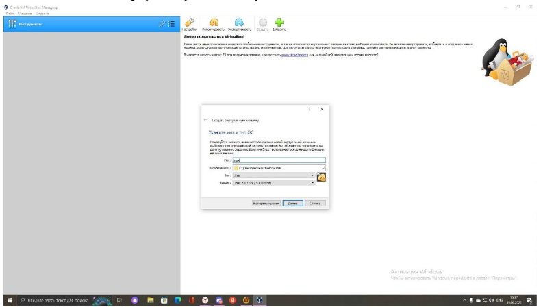{#fig:001 width=70%}

## Настройки

-Указание объема памяти
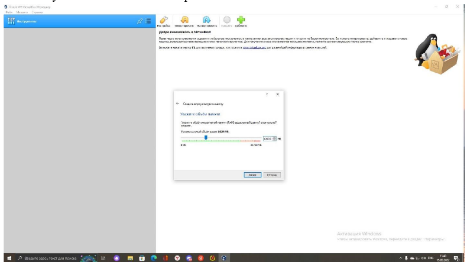{#fig:002 width=70%}

## Создание виртуального жесткого диска

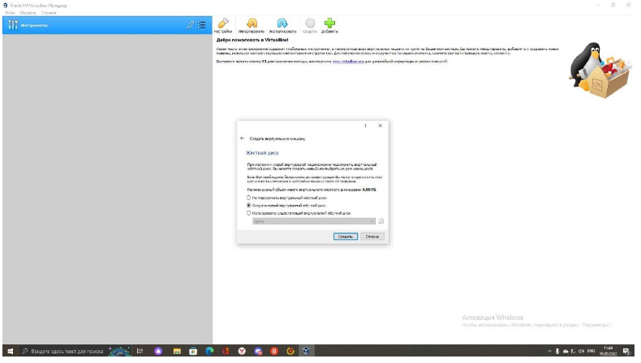{#fig:003 width=70%}

## Указания типа VDI

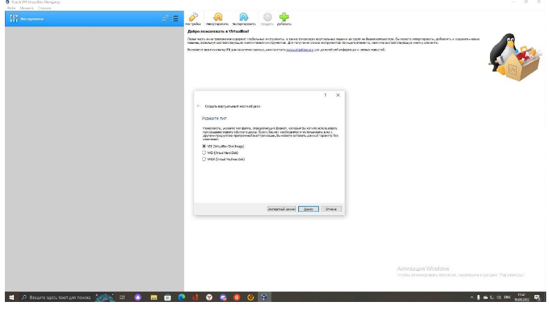{#fig:004 width=70%}

## Указание размера файла

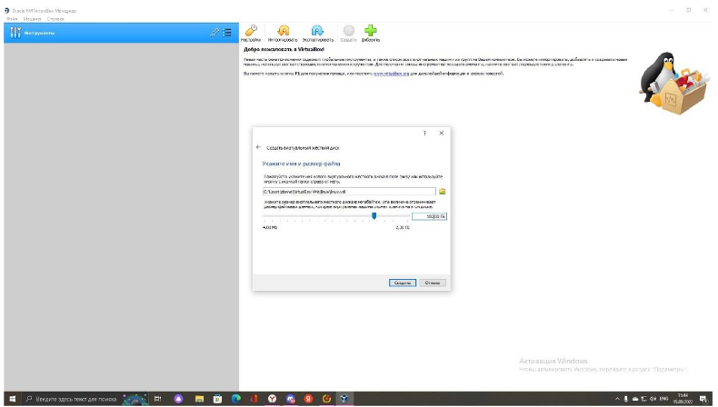{#fig:005 width=70%}

# Подключение дистрибутива к контроллеру

-Подключаем систему,на которой собираемся работать. в моем случае Fedora
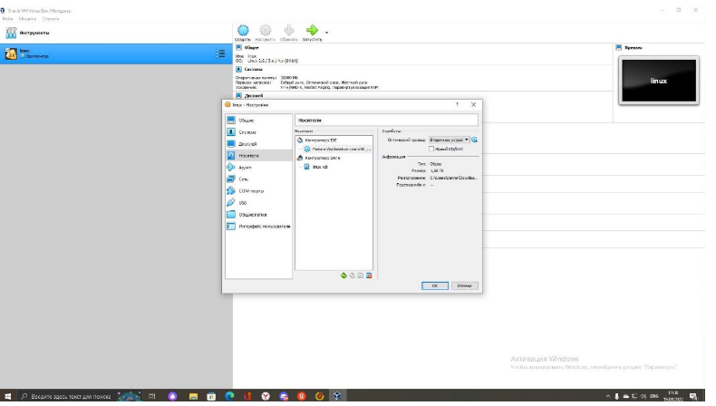{#fig:007 width=70%}

## Настройки

-После настройки региона,времени и языка,я создала имя пользователя,соответствующее тому,что в классе,поставила пароль.
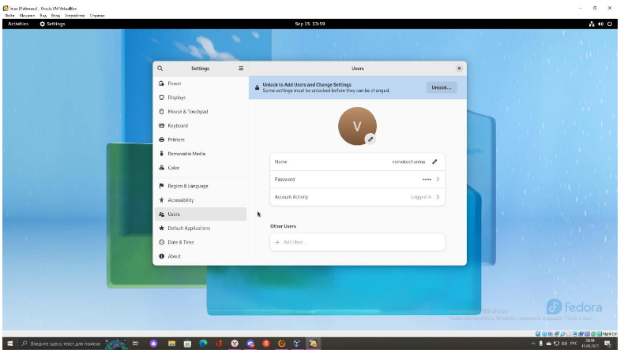{#fig:008 width=70%}

## Обновление,программы
Я обновила все пакеты,установила программы для удобства дальнейшей работы

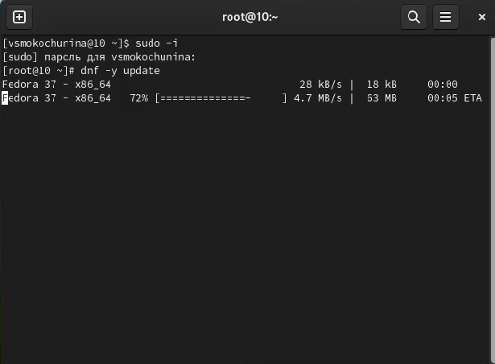{#fig:009 width=70%}

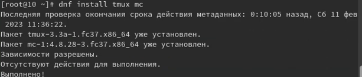{#fig:010 width=70%}

## Программы

Я установила необходимые программы для компиляции 
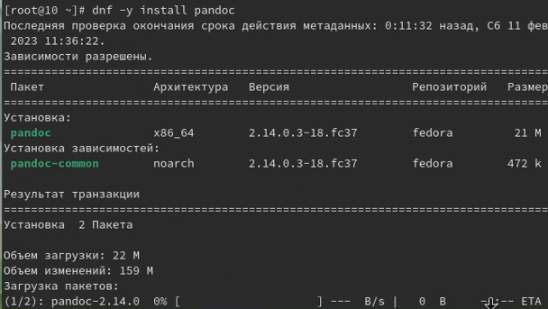{#fig:011 width=70%}
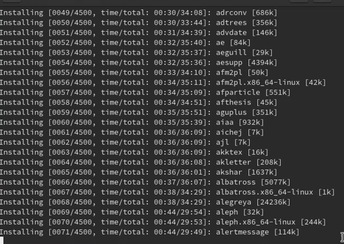{#fig:012 width=70%}

#Домашнее задание

## Анализ
Дождавшись загрузки графического окружения,я открыла терминал,проанализировала последовательность загрузки системы.

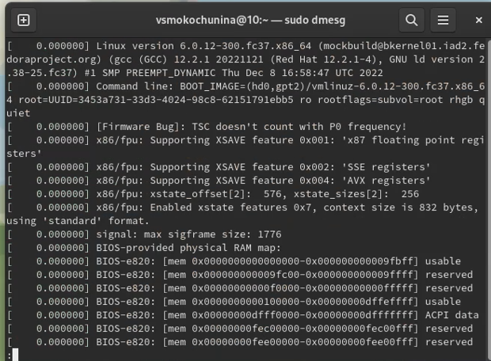{#fig:013 width=70%}

## Поиск

С помощью данной команды буду искать версию ядра Linux
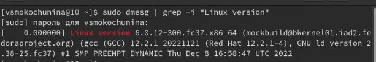{#fig:014 width=70%}

## Частота процессора

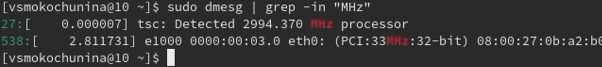{#fig:015 width=70%}

## Модель процессора

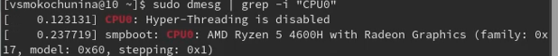{#fig:016 width=70%}

## Объем доступной оперативной памяти

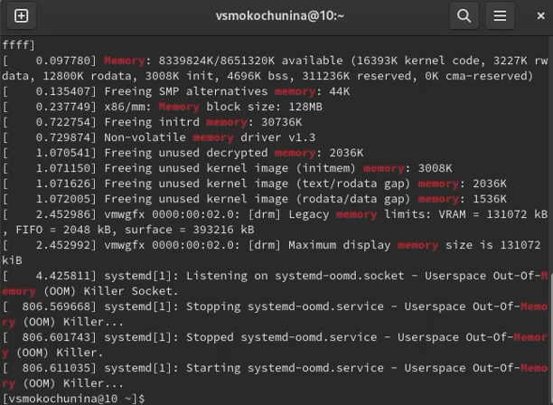{#fig:017 width=70%}

## Тип обнаруженного гипервизора

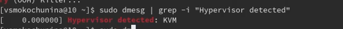{#fig:018 width=70%}

## Тип файловой системы корневого раздела и последовательность монтирования файловых систем.

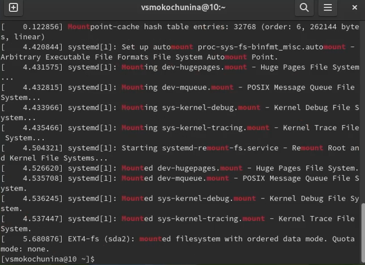{#fig:019 width=70%}

# Результаты

- В ходе лабораторной работы я изучила,как установить виртуальную машину,минимально настроить ее,а также находить информацию об установленной ОС.

## Заключение

Спасибо за внимание!
Будьте хорошими студентами!

:::

