---
## Front matter
title: "Отчёт по лабораторной работе №1"
subtitle: "Установка OC Linux"
author: "Мокочунина Влада Сергеевна"

## Generic otions
lang: ru-RU
toc-title: "Содержание"

## Bibliography
bibliography: bib/cite.bib
csl: pandoc/csl/gost-r-7-0-5-2008-numeric.csl

## Pdf output format
toc: true # Table of contents
toc-depth: 2
lof: true # List of figures
lot: true # List of tables
fontsize: 12pt
linestretch: 1.5
papersize: a4
documentclass: scrreprt
## I18n polyglossia
polyglossia-lang:
  name: russian
  options:
	- spelling=modern
	- babelshorthands=true
polyglossia-otherlangs:
  name: english
## I18n babel
babel-lang: russian
babel-otherlangs: english
## Fonts
mainfont: PT Serif
romanfont: PT Serif
sansfont: PT Sans
monofont: PT Mono
mainfontoptions: Ligatures=TeX
romanfontoptions: Ligatures=TeX
sansfontoptions: Ligatures=TeX,Scale=MatchLowercase
monofontoptions: Scale=MatchLowercase,Scale=0.9
## Biblatex
biblatex: true
biblio-style: "gost-numeric"
biblatexoptions:
  - parentracker=true
  - backend=biber
  - hyperref=auto
  - language=auto
  - autolang=other*
  - citestyle=gost-numeric
## Pandoc-crossref LaTeX customization
figureTitle: "Рис."
tableTitle: "Таблица"
listingTitle: "Листинг"
lofTitle: "Список иллюстраций"
lotTitle: "Список таблиц"
lolTitle: "Листинги"
## Misc options
indent: true
header-includes:
  - \usepackage{indentfirst}
  - \usepackage{float} # keep figures where there are in the text
  - \floatplacement{figure}{H} # keep figures where there are in the text
---

# Цель работы

Приобретение практических навыков установки ОС на виртуальную машину,настройки минимально необходимых для дальнейшей работы сервисов 

# Задание

Установить ОС на виртуальную машину и минимально настроить ее

# Выполнение лабораторной работы

В прошлом семестре я уже устанавливала виртуальную машину,поэтому воспользуюсь ей. Как устанавливала:
1. Я скачала виртуальную машину и дистрибутив.Создала виртуальную машину. (рис. [-@fig:001]).

{#fig:001 width=70%}

2. Я указала объем памяти, создала виртуальный жесткий диск,указала тип VDI,указала размер файла,настроила видеопамять.

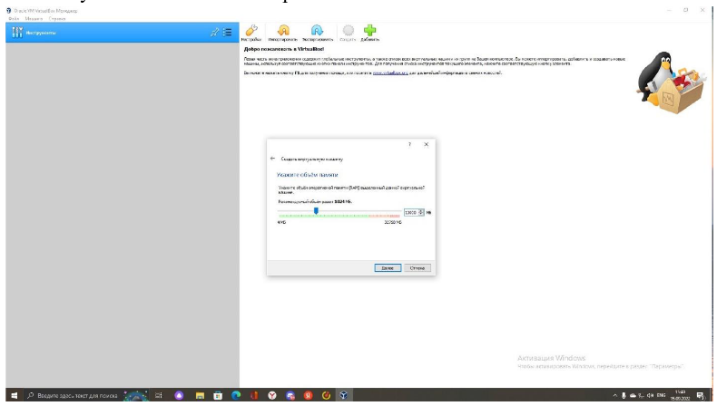{#fig:002 width=70%}

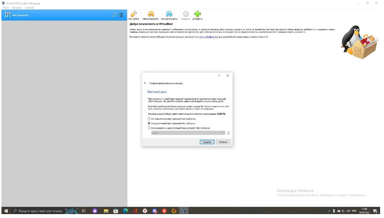{#fig:003 width=70%}

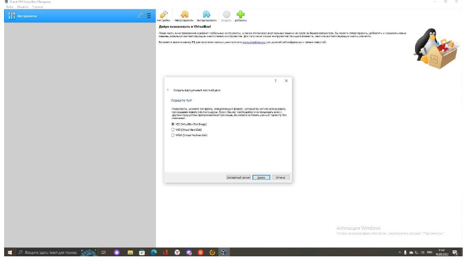{#fig:004 width=70%}

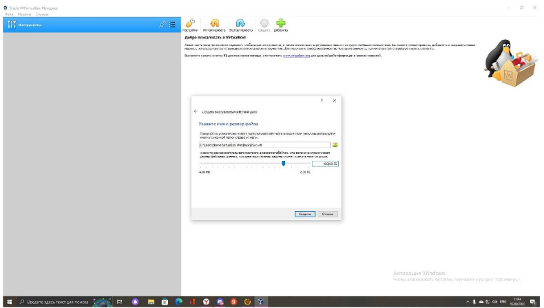{#fig:005 width=70%}

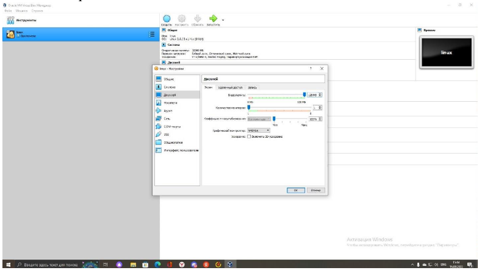{#fig:006 width=70%}

3. Подключение дистрибутива к контроллеру

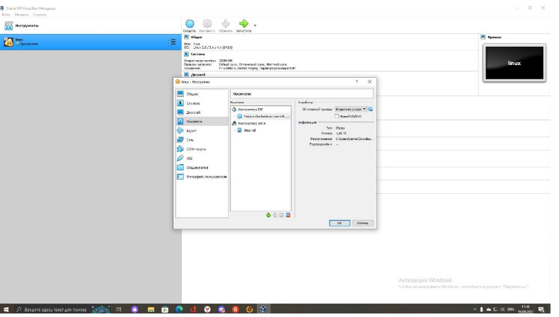{#fig:007 width=70%}

4. После настройки региона,времени и языка,я создала имя пользователя,соответствующее тому,что в классе,поставила пароль.

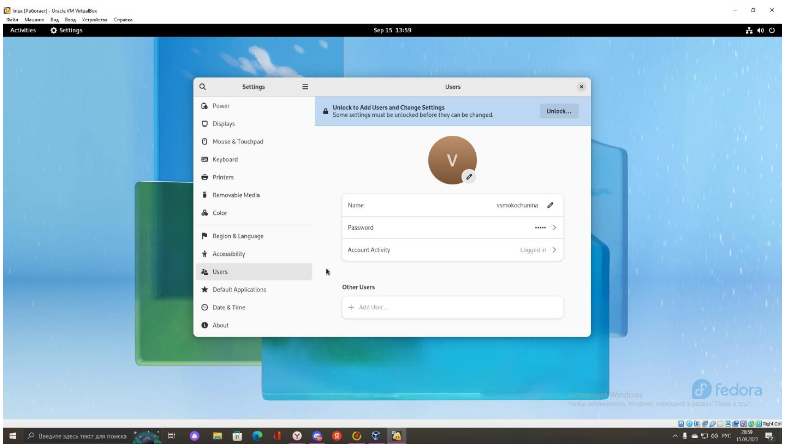{#fig:008 width=70%}

5. Я обновила все пакеты,установила программы для удобства дальнейшей работы

{#fig:009 width=70%}

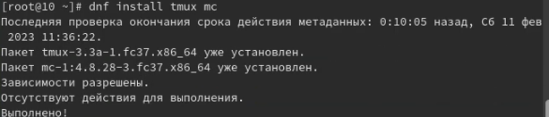{#fig:010 width=70%}

6. Я установила необходимые программы.

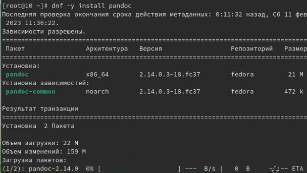{#fig:011 width=70%}

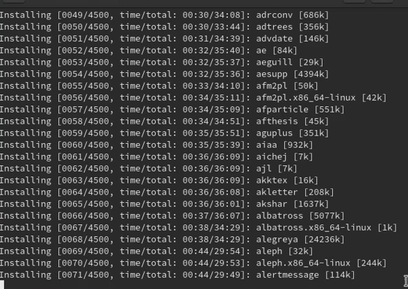{#fig:012 width=70%}

#Домашнее задание

1. Дождавшись загрузки графического окружения,я открыла терминал,проанализировала последовательность загрузки системы.

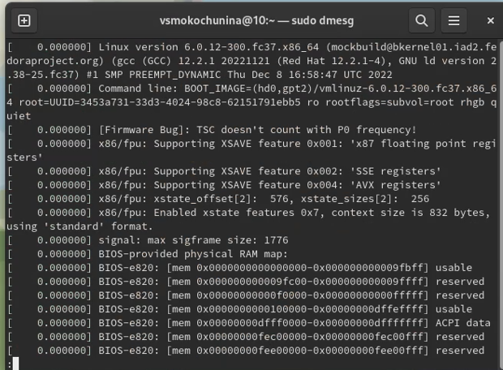{#fig:013 width=70%}

2. С помощью данной команды буду искать версию ядра Linux

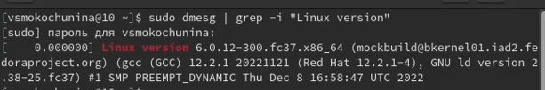{#fig:014 width=70%}

3. Частота процессора

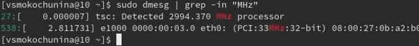{#fig:015 width=70%}

4. Модель процессора

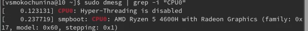{#fig:016 width=70%}

5. Объем доступной оперативной памяти

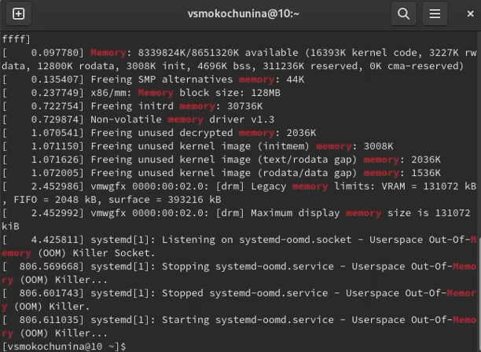{#fig:017 width=70%}

6. Тип обнаруженного гипервизора

{#fig:018 width=70%}

7. Тип файловой системы корневого раздела и последовательность монтирования файловых систем.

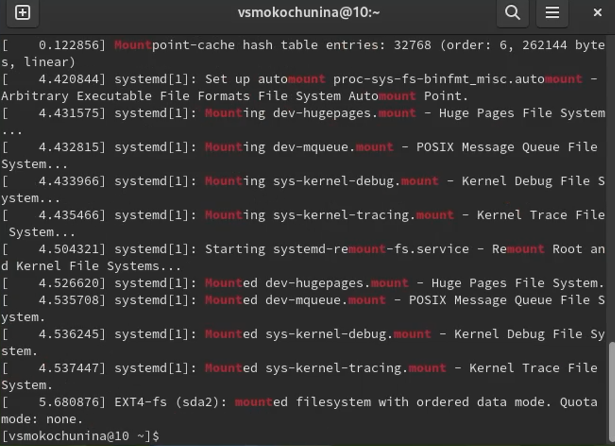{#fig:019 width=70%}

1. Какую информацию содержит учётная запись пользователя?
Linux — система многопользовательская, а потому пользователь — ключевое понятие для организации всей системы доступа в Linux. Когда пользователь регистрируется в системе (проходит процедуру авторизации, например, вводя системное имя и пароль), он идентифицируется с учётной записью, в которой система хранит информацию о каждом пользователе: его системное имя и некоторые другие сведения, необходимые для работы с ним. Именно с учётными записями, а не с самими пользователями, и работает система. 
 Учетная запись пользователя содержит:
Системное имя (user name)
Идентификатор пользователя (UID)
Идентификатор группы (GID)
Полное имя (full name)
Домашний каталог (home directory)
Начальная оболочка (login shell)

2. Укажите команды терминала и приведите примеры:
для получения справки по команде; команда man. Например, команда «man ls» выведет справку о команде «ls»
для перемещения по файловой системе; cd. Например, команда «cd newdir» осуществляет переход в каталог newdir
для просмотра содержимого каталога; ls. Например, команда «ls –a ~/newdir» отобразит имена скрытых файлов в каталоге newdir
для определения объёма каталога; du. Например, команда «du –k ~/newdir» выведет размер каталога newdir в килобайтах
для создания / удаления каталогов / файлов; mkdir/ rmdir/ rm.
Например, команда «mkdir –p ~/newdir1/newdir2» создаст иерархическую цепочку подкаталогов, создав каталоги newdir1 и newdir2; команда «rmdir -v ~/newdir» удалит каталог newdir; команда «rm –r ~/newdir» так же удалит каталог newdir
для задания определённых прав на файл / каталог; сhmod. Например, команда «сhmod g+r ~/text.txt» даст группе право на чтение файла text.txt
для просмотра истории команд. history. Например, команда «history 5» покажет список последних 5 команд

3. Что такое файловая система? Приведите примеры с краткой характеристикой.
Файловая система – это инструмент, позволяющий операционной системе и программам обращаться к нужным файлам и работать с ними. При этом программы оперируют только названием файла, его размером и датой созданий. Все остальные функции по поиску необходимого файла в хранилище и работе с ним берет на себя файловая система накопителя. 
Типы файловых систем:
    Журналируемая файловая система (JFS)
    Журналируемые файловые системы позволяют быстро восстанавливать данные в случае сбоя. Это достигается за счет ведения журнала изменений файлов.
    Расширенная JFS
    Расширенная JFS, или JFS2, - это еще одна внутренняя файловая система AIX.
    Различия между JFS и расширенной JFS
    В этом разделе перечислены различия между JFS и расширенной JFS (JFS2).
    Файловая система на компакт-диске
    Это файловая система, которая хранится на компакт-диске и доступна только для чтения.
    файловая система RAM
    Диск RAM - это виртуальный жесткий диск, хранящийся в оперативной памяти.
    Сетевая файловая система (NFS)
    Сетевая файловая система, или NFS, - это распределенная файловая система, предоставляющая доступ к файлам и каталогам, хранящимся в удаленных системах, обычными средствами для работы с локальными файлами. Например, обычными командами операционной системы можно создавать, удалять, читать и записывать файлы, а также изменять их атрибуты.
    Система имен файлов (NameFS)
    Система имен файлов содержит функции монтирования файл-на-файл и каталог-на-каталог (также называемое слабое монтирование), которые позволяют монтировать подкаталог или файловую систему в другом месте в области имен файлов, что позволяет иметь доступ к файлу с помощью двух различных путей.
    Базовая параллельная файловая система
    Распараллеленные файловые системы или GPFS - это высокопроизводительные файловые системы, распределенные по нескольким общим жестким дискам и применяемые для обеспечения быстрого доступа к данным для всех узлов кластера. Для работы с ними применяются стандартные интерфейсы UNIX или AIX.

4. Как посмотреть, какие файловые системы подмонтированы в ОС?

Команда findmnt — это простая утилита командной строки, используемая для отображения списка смонтированных файловых систем или поиска файловой системы в /etc/fstab, /etc/mtab и /proc/self/mountinfo.

5. Как удалить зависший процесс?
Находим процесс с помощью команды ps
Для завершения процесса нужно вызвать утилиту kill с параметром "-9". В этом случае она просто убьет процесс без процедуры "завершитесь, пожалуйста" 
Также можно использовать утилиту killall, когда необходимо убить дерево процессов.

# Выводы

В ходе лабораторной работы я изучила,как установить виртуальную машину,минимально настроить ее,а также находить информацию об установленной ОС.

# Список литературы{.unnumbered}

::: {#refs}
:::
