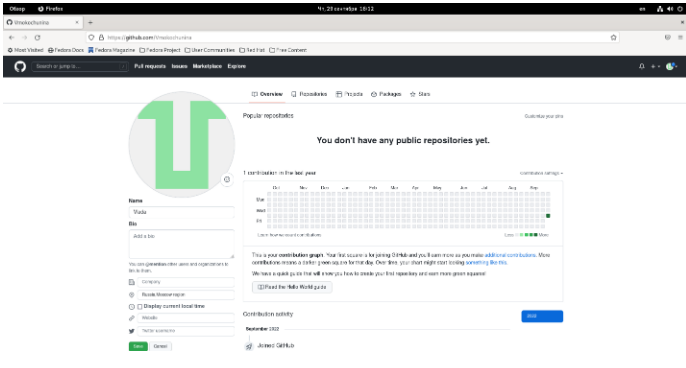
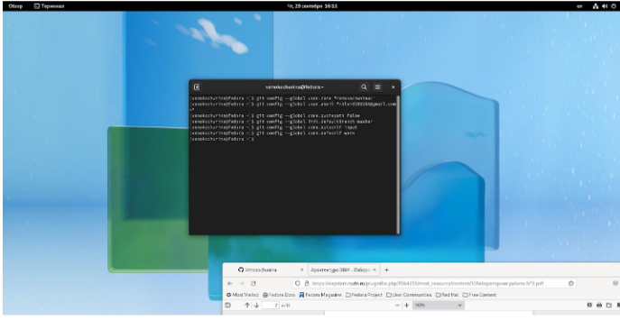
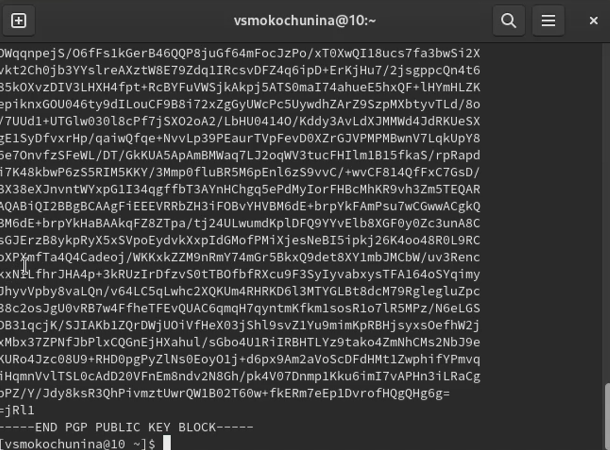

---
## Front matter
lang: ru-RU
title: Презентация по лабораторной работе №2
subtitle: Первоначальна настройка git.
author:
  - Мокочунина В.С.
institute:
  - Российский университет дружбы народов, Москва, Россия
date: 15 января 2023 год

## i18n babel
babel-lang: russian
babel-otherlangs: english

## Formatting pdf
toc: false
toc-title: Содержание
slide_level: 2
aspectratio: 169
section-titles: true
theme: metropolis
header-includes:
 - \metroset{progressbar=frametitle,sectionpage=progressbar,numbering=fraction}
 - '\makeatletter'
 - '\beamer@ignorenonframefalse'
 - '\makeatother'
---

# Информация

## Докладчик

:::::::::::::: {.columns align=center}
::: {.column width="70%"}

  * Мокочунина Влада Сергеевна
  * студент направления "Математика и механика" 
  * Российский университет дружбы народов
  * [vmokochunina@gmail.com](mailto:vmokochunina@gmail.com)
  * <https://github.com/Vmokochunina/os-intro.git>

:::
::: {.column width="30%"}

# Вводная часть

## Актуальность

-Системы контроля версий (Version Control System, VCS) являются необходимым инструментом для работы в наше время. Благодаря им люди могут работать вместе над одним проектом с разных устройств,дополняя идеи друг друга.

## Объект и предмет исследования

- Первоначальна настройка git

## Цели и задачи

- Создать базовую конфигурацию для работы с git.
- Создать ключ SSH.
- Создать ключ PGP.
- Настроить подписи git.
- Зарегистрироваться на Github.
- Создать локальный каталог для выполнения заданий по предмету.

## Материалы и методы
- Github
- Теоретические материалы к лабоработрной работе №2
- Процессор `pandoc` для входного формата Markdown
- Результирующие форматы
	- `pdf`
	- `html`
- Автоматизация процесса создания: `Makefile`

# Презентация

## Регистрация на Github

- Github-один систем контроля версий
- Сайт: <https://www.google.com/url?sa=t&rct=j&q=&esrc=s&source=web&cd=&cad=rja&uact=8&ved=2ahUKEwiU2JT0g5j9AhVEgf0HHW0PDRcQFnoECAkQAQ&url=https%3A%2F%2Fgithub.com%2F&usg=AOvVaw38IHvcyBra8HGhmSxvlCGw>
- Как я сосдавала учетную запись (рис. [-@fig:001])
{#fig:001 width=70%}

## Предварительная конфигурация git,настройка utf-8 в выводе сообщений git.

-для дальнейшей работы делаем конфигурацию,настройку utf-8
{#fig:002 width=70%}]
{#fig:003 width=70%}]

## Задание имени начальной ветки, параметра autocrlf,safecrlf.

{#fig:004 width=70%}]

## Генерация ключей.

Используется для привязки компьютера к репозиторию
{#fig:005 width=70%}]

## Загрузка сгенерированного ключа.

{#fig:006 width=70%}]

## Генерация ключа pgp.

{#fig:009 width=70%}]

## Вывод и добавление ключа

{#fig:008 width=70%}]
{#fig:009 width=70%}]

## Создание папки для будущей работы

{#fig:010 width=70%}]

## Создание репозитория.

{#fig:011 width=70%}]

{#fig:012 width=70%}]

## Шаблон курса скопировался.

Для удобства работы с лабораторными
{#fig:013 width=70%}]

## Удаление лишних файлов.

{#fig:014 width=70%}]

## Создание необходимых каталогов.

Каталоги с лабораторными работами и шаблонами
{#fig:015 width=70%}]

## Отправка файлов на сервер.

Для сохранения файлов и каталогов в репозитории
{#fig:016 width=70%}]

## Результаты

Я научилась создавать базовую конфигурацию для работы с git,создавать ключи,настраивать подписи git,создавать локальный каталог для выполнения заданий по предмету.

## Заключение

Спасибо за внимание!

:::

