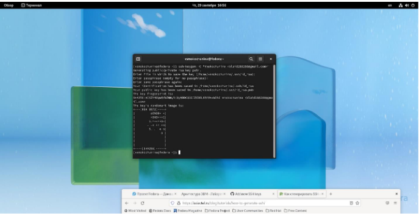
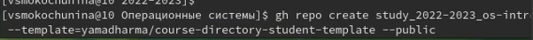

---
## Front matter
title: "Отчёт по лабораторной работе №2"
subtitle: "Первоначальна настройка git."
author: "Мокочунина Влада Сергеевна"

## Generic otions
lang: ru-RU
toc-title: "Содержание"

## Bibliography
bibliography: bib/cite.bib
csl: pandoc/csl/gost-r-7-0-5-2008-numeric.csl

## Pdf output format
toc: true # Table of contents
toc-depth: 2
lof: true # List of figures
lot: true # List of tables
fontsize: 12pt
linestretch: 1.5
papersize: a4
documentclass: scrreprt
## I18n polyglossia
polyglossia-lang:
  name: russian
  options:
	- spelling=modern
	- babelshorthands=true
polyglossia-otherlangs:
  name: english
## I18n babel
babel-lang: russian
babel-otherlangs: english
## Fonts
mainfont: PT Serif
romanfont: PT Serif
sansfont: PT Sans
monofont: PT Mono
mainfontoptions: Ligatures=TeX
romanfontoptions: Ligatures=TeX
sansfontoptions: Ligatures=TeX,Scale=MatchLowercase
monofontoptions: Scale=MatchLowercase,Scale=0.9
## Biblatex
biblatex: true
biblio-style: "gost-numeric"
biblatexoptions:
  - parentracker=true
  - backend=biber
  - hyperref=auto
  - language=auto
  - autolang=other*
  - citestyle=gost-numeric
## Pandoc-crossref LaTeX customization
figureTitle: "Рис."
tableTitle: "Таблица"
listingTitle: "Листинг"
lofTitle: "Список иллюстраций"
lotTitle: "Список таблиц"
lolTitle: "Листинги"
## Misc options
indent: true
header-includes:
  - \usepackage{indentfirst}
  - \usepackage{float} # keep figures where there are in the text
  - \floatplacement{figure}{H} #git push keep figures where there are in the text
---

# Цель работы

Изучить идеологию и применение средств контроля версий. Освоить умения по работе с git.

# Задание

Создать базовую конфигурацию для работы с git.
Создать ключ SSH.
Создать ключ PGP.
Настроить подписи git.
Зарегистрироваться на Github.
Создать локальный каталог для выполнения заданий по предмету.

# Выполнение лабораторной работы

 1. Я создала учётную запись на сайте https://github.com/ и заполнила
основные данные.(рис. [-@fig:001]).

{#fig:001 width=70%}

2. Я сделала предварительную конфигурацию git.

{#fig:002 width=70%}]

3. Я настроила utf-8 в выводе сообщений git.

{#fig:003 width=70%}]

4. Я задала имя начальной ветки, параметр autocrlf и параметр safecrlf.

{#fig:004 width=70%}]

5. Я сгенерировала пару ключей (приватный и открытый).

{#fig:005 width=70%}]

6. Я загрузила сгенерённый открытый ключ.

{#fig:006 width=70%}]

7. Я сгенерировала ключ pgp.

{#fig:007 width=70%}]

8. Я вывела сгенерированный ключ.

{#fig:008 width=70%}]

9. Добавление ключа pgp.

{#fig:009 width=70%}]

10. Я создала папку для будущей работы.

{#fig:010 width=70%}]

11. Создание репозитория.

{#fig:011 width=70%}]

{#fig:012 width=70%}]

12. Тут мы видим,что шаблон курса скопировался.

{#fig:013 width=70%}]

13. Удаление лишних файлов.

{#fig:014 width=70%}]

14. Создание необходимых каталогов.

{#fig:015 width=70%}]

15. Отправка файлов на сервер.

{#fig:016 width=70%}]
#Контрольные вопросы

1. Что такое системы контроля версий (VCS) и для решения каких задач они предназначаются?
Контроль версий, также известный как управление исходным кодом, — это практика отслеживания изменений программного кода и управления ими. Системы контроля версий — это программные инструменты, помогающие командам разработчиков управлять изменениями в исходном коде с течением времени.
2. Объясните следующие понятия VCS и их отношения: хранилище, commit, история, рабочая копия.
Репозиторий - хранилище версий - в нем хранятся все документы вместе с историей их изменения и другой служебной информацией.
Рабочая копия - копия проекта, связанная с репозиторием
commit - сохранение изменений в репозитории
3. Что представляют собой и чем отличаются централизованные и децентрализованные VCS? Приведите примеры VCS каждого вида.
Централизованные системы контроля версий представляют собой приложения типа клиент-сервер, когда репозиторий проекта существует в единственном экземпляре и хранится на сервере. Доступ к нему осуществлялся через специальное клиентское приложение. В качестве примеров таких программных продуктов можно привести CVS, Subversion.
Децентрализованные системы контроля версий — СКВ, которые позволяют клиенту полностью хранить у себя копию репозитория проекта. Примеры: Git, Mercurial, Bazaar или, например, Darcs. 
4. Опишите действия с VCS при единоличной работе с хранилищем.
Хранилище является разновидностью файл-сервера, однако не совсем обычного.
•Хранилище запоминает каждое внесенное изменение:
-любое изменение любого файла,
-изменения в самом дереве каталогов, такие как добавление, удаление и реорганизация файлов и каталогов.
•При чтении данных из хранилища клиент обычно видит только последнюю версию дерева файлов.
•Клиент также имеет возможность просмотреть предыдущие состояния файловой системы.
•Вопросы типа
«Что содержал этот каталог в прошлую среду?», «Кто был последним, изменявшим этот файл, и какие вносились изменения?»
5. Опишите порядок работы с общим хранилищем VCS.
6. Каковы основные задачи, решаемые инструментальным средством git?
Системы контроля версий поддерживают возможность отслеживания и разрешения конфликтов, которые могут возникнуть при работе нескольких человек над одним файлом. Можно объединить (слить) изменения, сделанные разными участниками (автоматически или вручную), вручную выбрать нужную версию, отменить изменения вовсе или заблокировать файлы для изменения. В зависимости от настроек блокировка не позволяет другим пользователям получить рабочую копию или препятствует изменению рабочей копии файла средствами файловой системы ОС, обеспечивая таким образом, привилегированный доступ только одному пользователю, работающему с файлом.
Системы контроля версий также могут обеспечивать дополнительные, более гибкие функциональные возможности. Например, они могут поддерживать работу с несколькими версиями одного файла, сохраняя общую историю изменений до точки ветвления версий и собственные истории изменений каждой ветви. Кроме того, обычно доступна информация о том, кто из участников, когда и какие изменения вносил. Обычно такого рода информация хранится в журнале изменений, доступ к которому можно ограничить.
7. Назовите и дайте краткую характеристику командам git.
Создание основного дерева репозитория:
git init
Получение обновлений (изменений) текущего дерева из центрального репозитория:
git pull
Отправка всех произведённых изменений локального дерева в центральный репозиторий:
git push
Просмотр списка изменённых файлов в текущей директории:
git status
Просмотр текущих изменений:
git diff
Сохранение текущих изменений:
добавить все изменённые и/или созданные файлы и/или каталоги:
git add .
добавить конкретные изменённые и/или созданные файлы и/или каталоги:
git add имена_файлов
удалить файл и/или каталог из индекса репозитория (при этом файл и/или каталог остаётся в локальной директории):
git rm имена_файлов
Сохранение добавленных изменений:
сохранить все добавленные изменения и все изменённые файлы:
git commit -am 'Описание коммита'
сохранить добавленные изменения с внесением комментария через встроенный редактор:
git commit
создание новой ветки, базирующейся на текущей:
git checkout -b имя_ветки
переключение на некоторую ветку:
git checkout имя_ветки
8. Приведите примеры использования при работе с локальным и удалённым репозиториями.
9. Что такое и зачем могут быть нужны ветви (branches)?
Ветки нужны для того, чтобы программисты могли вести совместную работу над проектом и не мешать друг другу при этом. При создании проекта, Git создает базовую ветку. Она называется master веткой.
10. Как и зачем можно игнорировать некоторые файлы при commit?
Чтобы игнорировать файл, для которого ранее был сделан коммит, необходимо удалить этот файл из репозитория, а затем добавить для него правило в .gitignore .

# Выводы

Я научилась создавать базовую конфигурацию для работы с git,создавать ключи,настраивать подписи git,создавать локальный каталог для выполнения заданий по предмету.

