---
## Front matter
lang: ru-RU
title: Отчёта по лабораторной работе №4
subtitle: Основы интерфейса взаимодействия пользователя с системой Unix на уровне командной строки
author:
  - Мокочунина В. С.
institute:
  - Российский университет дружбы народов, Москва, Россия
date: 03 марта 2023

## i18n babel
babel-lang: russian
babel-otherlangs: english

## Formatting pdf
toc: false
toc-title: Содержание
slide_level: 2
aspectratio: 169
section-titles: true
theme: metropolis
header-includes:
 - \metroset{progressbar=frametitle,sectionpage=progressbar,numbering=fraction}
 - '\makeatletter'
 - '\beamer@ignorenonframefalse'
 - '\makeatother'
---

# Информация

## Докладчик

:::::::::::::: {.columns align=center}
::: {.column width="70%"}

  * Мокочунина Влада Сергеевна
  * Российский университет дружбы народов
  * [vmokochunina@gmail.com](mailto:vmokochunina@gmail.com)
  * <https://github.com/Vmokochunina/study_2022-2023_os-intro>

:::
::: {.column width="30%"}
:::
::::::::::::::

# Вводная часть

## Актуальность

Умение пользоваться основными командами для работы с файлами и каталогами

## Объект и предмет исследования

Каталоги и файлы

## Цели и задачи

Приобретение практических навыков взаимодействия пользователя с системой по-
средством командной строки.

## Материалы и методы

Команды для работы с файлами и каталогами

# Создание презентации

##  Определила полное имя моего домашнего каталога. 

(рис. [-@fig:001]).

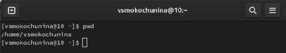{#fig:001 width=70%}

##  Перешла в каталог /tmp.

{#fig:002 width=70%}

##  Вывела на экран содержимое каталога /tmp.

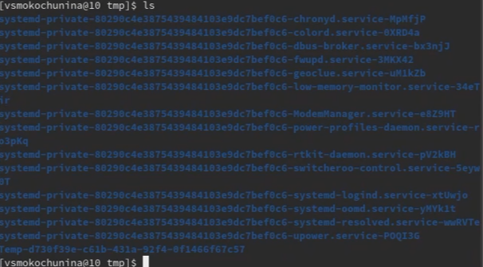{#fig:003 width=70%}

Тут мы можем видеть содержимое каталога

## 

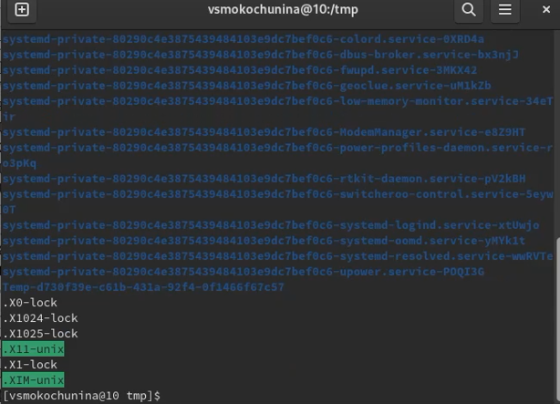{#fig:004 width=70%}

Тут мы можем видеть скрытые файлы в каталоге

## 

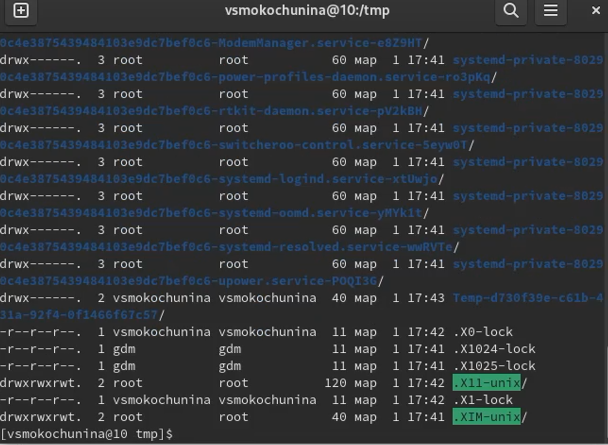{#fig:005 width=70%}

Тут мы можем посмотреть права доступа к каждому файлу/каталогу

##  Определила, есть ли в каталоге /var/spool подкаталог с именем cron. Его нет

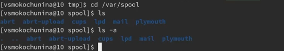{#fig:006 width=70%}

##  Перейдите в мой домашний каталог и вывела на экран его содержимое. Определила, что я - владелец файлов и подкаталогов

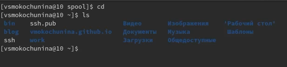{#fig:007 width=70%}

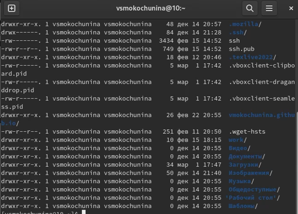{#fig:008 width=70%}

##   В домашнем каталоге создала новый каталог с именем newdir.

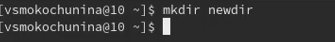{#fig:009 width=70%}

##  В каталоге ~/newdir создала новый каталог с именем morefun.

{#fig:010 width=70%}

##  В домашнем каталоге создала одной командой три новых каталога с именами letters, memos, misk. Затем удалила эти каталоги одной командой.

{#fig:011 width=70%}

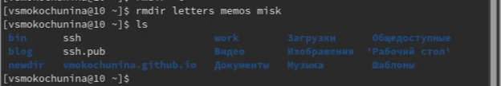{#fig:012 width=70%}

##  Попробовала удалить ранее созданный каталог ~/newdir командой rm. Проверила,был ли каталог удалён.

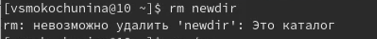{#fig:013 width=70%}

Каталог невозможно удалить,тк он содержит подкаталог

##  Удалила каталог ~/newdir/morefun из домашнего каталога. Проверила, был ли каталог удалён.

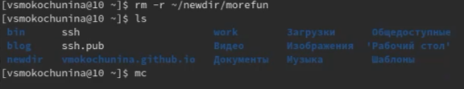{#fig:014 width=70%}

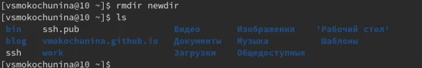{#fig:015 width=70%}

##  С помощью команды man определила, какую опцию команды ls нужно использовать для просмотра содержимое не только указанного каталога, но и подкаталогов,входящих в него

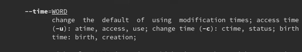{#fig:016 width=70%}

##  С помощью команды man определила набор опций команды ls, позволяющий отсортировать по времени последнего изменения выводимый список содержимого каталога с развёрнутым описанием файлов

{#fig:017 width=70%}

##  Использовала команду man для просмотра описания следующих команд: cd, pwd, mkdir, rmdir, rm. 

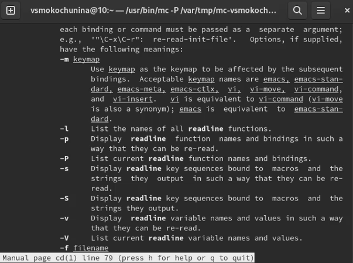{#fig:018 width=70%}

    −L , переходить по символическим ссылкам . По умолчанию cd ведет себя так, как если бы указана опция -L .
    −P , не переходите по символическим ссылкам. Другими словами, когда эта опция указана, и вы пытаетесь перейти к символической ссылке, которая указывает на каталог, cd перейдет в каталог.

## 

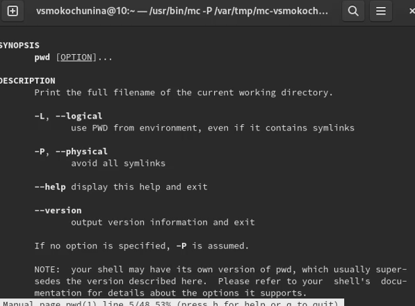{#fig:019 width=70%}

-L, --logical - брать директорию из переменной окружения, даже если она содержит символические ссылки;
-P - отбрасывать все символические ссылки;
--help - отобразить справку по утилите;

## 

{#fig:020 width=70%}

-p или --parents
Создать все директории, которые указаны внутри пути. Если какая-либо директория существует, то предупреждение об этом не выводится.
-v или --verbose
Выводить сообщение о каждой создаваемой директории.

## 

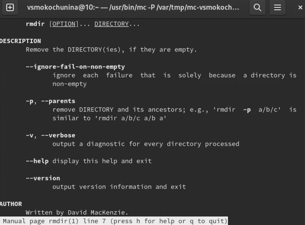{#fig:021 width=70%}

--ignore-fail-on-non-empty
    Обычно rmdir будет отказываться удалять непустые каталоги. Данная опция заставляет rmdir игнорировать ошибки при удалении каталога, если эти ошибки вызваны тем, что каталог не пуст. 

## 

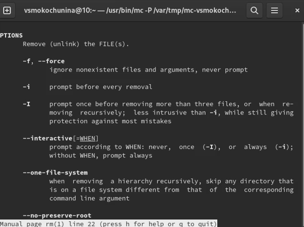{#fig:023 width=70%}

-f или --force
Игнорировать несуществующие файлы и аргументы. Никогда не выдавать запросы на подтверждение удаления.
-i
Выводить запрос на подтверждение удаления каждого файла.

##  Используя информацию, полученную при помощи команды history, выполнила модификацию и исполнение нескольких команд из буфера команд.

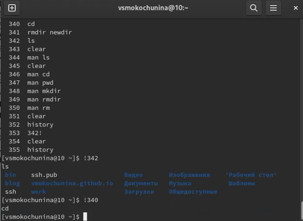{#fig:023 width=70%}

## Заключение

Спасибо за внимание!
