---
## Front matter
title: "Отчёта по лабораторной работе №4"
subtitle: "Основы интерфейса взаимодействия пользователя с системой Unix на уровне командной строки"
author: "Мокочунина Влада Сергеевна"

## Generic otions
lang: ru-RU
toc-title: "Содержание"

## Bibliography
bibliography: bib/cite.bib
csl: pandoc/csl/gost-r-7-0-5-2008-numeric.csl

## Pdf output format
toc: true # Table of contents
toc-depth: 2
lof: true # List of figures
lot: true # List of tables
fontsize: 12pt
linestretch: 1.5
papersize: a4
documentclass: scrreprt
## I18n polyglossia
polyglossia-lang:
  name: russian
  options:
	- spelling=modern
	- babelshorthands=true
polyglossia-otherlangs:
  name: english
## I18n babel
babel-lang: russian
babel-otherlangs: english
## Fonts
mainfont: PT Serif
romanfont: PT Serif
sansfont: PT Sans
monofont: PT Mono
mainfontoptions: Ligatures=TeX
romanfontoptions: Ligatures=TeX
sansfontoptions: Ligatures=TeX,Scale=MatchLowercase
monofontoptions: Scale=MatchLowercase,Scale=0.9
## Biblatex
biblatex: true
biblio-style: "gost-numeric"
biblatexoptions:
  - parentracker=true
  - backend=biber
  - hyperref=auto
  - language=auto
  - autolang=other*
  - citestyle=gost-numeric
## Pandoc-crossref LaTeX customization
figureTitle: "Рис."
tableTitle: "Таблица"
listingTitle: "Листинг"
lofTitle: "Список иллюстраций"
lotTitle: "Список таблиц"
lolTitle: "Листинги"
## Misc options
indent: true
header-includes:
  - \usepackage{indentfirst}
  - \usepackage{float} # keep figures where there are in the text
  - \floatplacement{figure}{H} # keep figures where there are in the text
---

# Цель работы

Приобретение практических навыков взаимодействия пользователя с системой по-
средством командной строки.

# Задание

Приобрести практические навыки взаимодействия пользователя с системой по-
средством командной строки.

# Теоретическое введение

Команда man. Команда man используется для просмотра (оперативная помощь) в диа-
логовом режиме руководства (manual) по основным командам операционной системы
типа Linux.
Формат команды:
man <команда>
Команда cd. Команда cd используется для перемещения по файловой системе опера-
ционной системы типа Linux
Команда pwd. Для определения абсолютного пути к текущему каталогу используется
команда pwd (print working directory).
Команда ls. Команда ls используется для просмотра содержимого каталога.
Формат команды:
ls [-опции] [путь]
Команда mkdir. Команда mkdir используется для создания каталогов.
Формат команды:
mkdir имя_каталога1 [имя_каталога2...]
Команда rm. Команда rm используется для удаления файлов и/или каталогов.
Формат команды:
rm [-опции] [файл]
Команда history. Для вывода на экран списка ранее выполненных команд исполь-
зуется команда history. Выводимые на экран команды в списке нумеруются. К любой
команде из выведенного на экран списка можно обратиться по её номеру в списке,
воспользовавшись конструкцией !<номер_команды>.

# Выполнение лабораторной работы

1. Определила полное имя моего домашнего каталога. (рис. [-@fig:001]).

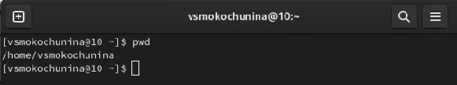{#fig:001 width=70%}

2. Перешла в каталог /tmp.

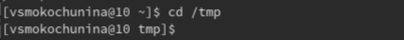{#fig:002 width=70%}

3. Вывела на экран содержимое каталога /tmp.

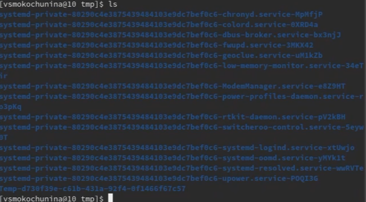{#fig:003 width=70%}

Тут мы можем видеть содержимое каталога

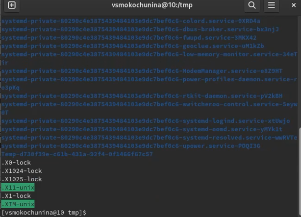{#fig:004 width=70%}

Тут мы можем видеть скрытые файлы в каталоге

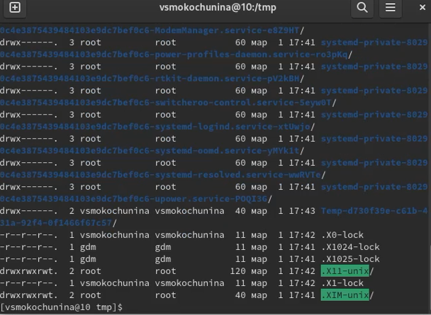{#fig:005 width=70%}

Тут мы можем посмотреть права доступа к каждому файлу/каталогу

4. Определила, есть ли в каталоге /var/spool подкаталог с именем cron. Его нет

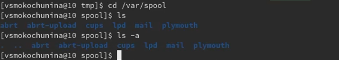{#fig:006 width=70%}

5. Перейдите в мой домашний каталог и вывела на экран его содержимое. Определила, что я - владелец файлов и подкаталогов

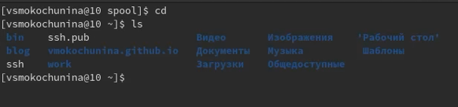{#fig:007 width=70%}

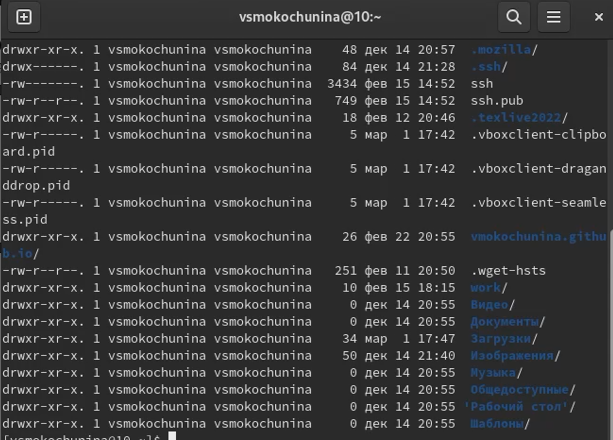{#fig:008 width=70%}

6.  В домашнем каталоге создала новый каталог с именем newdir.

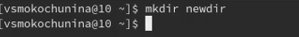{#fig:009 width=70%}

7. В каталоге ~/newdir создала новый каталог с именем morefun.

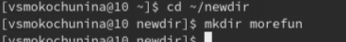{#fig:010 width=70%}

8. В домашнем каталоге создала одной командой три новых каталога с именами letters, memos, misk. Затем удалила эти каталоги одной командой.

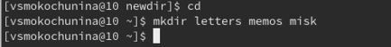{#fig:011 width=70%}

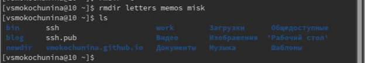{#fig:012 width=70%}

9. Попробовала удалить ранее созданный каталог ~/newdir командой rm. Проверила,был ли каталог удалён.

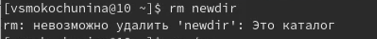{#fig:013 width=70%}

Каталог невозможно удалить,тк он содержит подкаталог

10. Удалила каталог ~/newdir/morefun из домашнего каталога. Проверила, был ли каталог удалён.

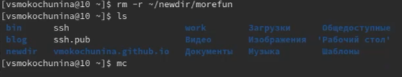{#fig:014 width=70%}

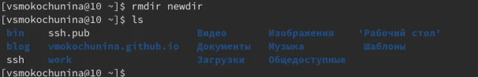{#fig:015 width=70%}

11. С помощью команды man определила, какую опцию команды ls нужно использовать для просмотра содержимое не только указанного каталога, но и подкаталогов,входящих в него

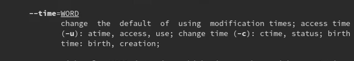{#fig:016 width=70%}

12. С помощью команды man определила набор опций команды ls, позволяющий отсортировать по времени последнего изменения выводимый список содержимого каталога с развёрнутым описанием файлов

{#fig:017 width=70%}

13. Использовала команду man для просмотра описания следующих команд: cd, pwd, mkdir, rmdir, rm. 

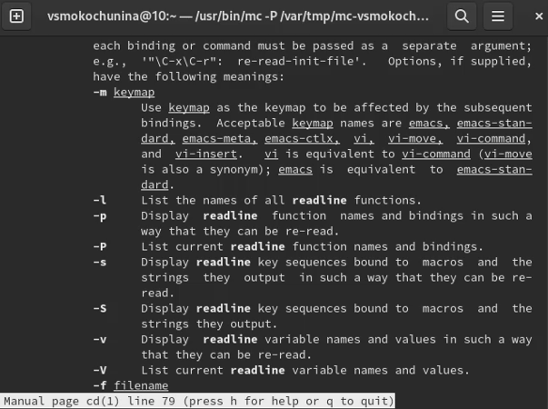{#fig:018 width=70%}

    −L , переходить по символическим ссылкам . По умолчанию cd ведет себя так, как если бы указана опция -L .
    −P , не переходите по символическим ссылкам. Другими словами, когда эта опция указана, и вы пытаетесь перейти к символической ссылке, которая указывает на каталог, cd перейдет в каталог.

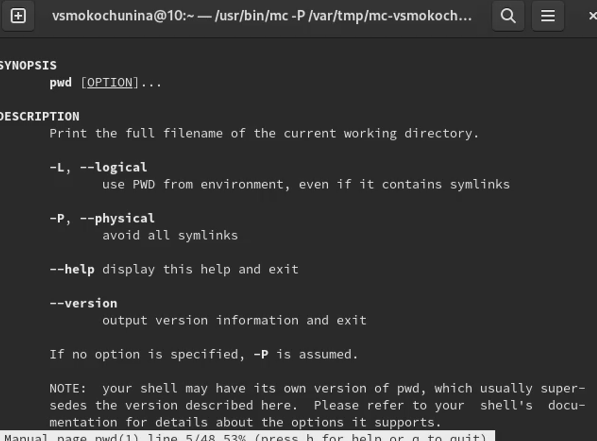{#fig:019 width=70%}

-L, --logical - брать директорию из переменной окружения, даже если она содержит символические ссылки;
-P - отбрасывать все символические ссылки;
--help - отобразить справку по утилите;

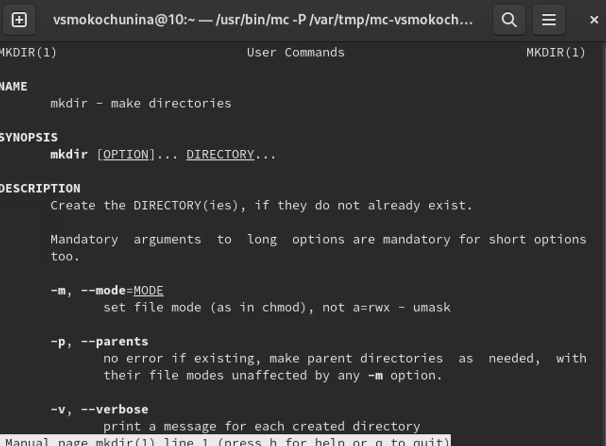{#fig:020 width=70%}

-p или --parents
Создать все директории, которые указаны внутри пути. Если какая-либо директория существует, то предупреждение об этом не выводится.
-v или --verbose
Выводить сообщение о каждой создаваемой директории.

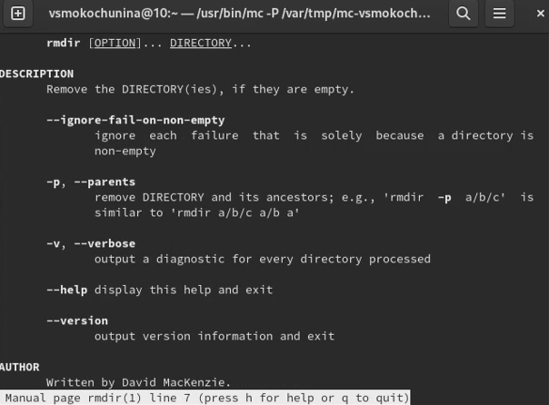{#fig:021 width=70%}

--ignore-fail-on-non-empty
    Обычно rmdir будет отказываться удалять непустые каталоги. Данная опция заставляет rmdir игнорировать ошибки при удалении каталога, если эти ошибки вызваны тем, что каталог не пуст. 

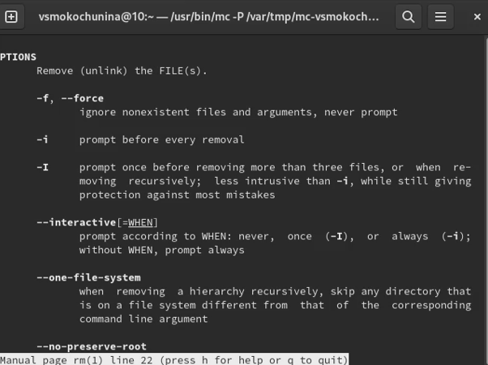{#fig:023 width=70%}

-f или --force
Игнорировать несуществующие файлы и аргументы. Никогда не выдавать запросы на подтверждение удаления.
-i
Выводить запрос на подтверждение удаления каждого файла.

14. Используя информацию, полученную при помощи команды history, выполнила модификацию и исполнение нескольких команд из буфера команд.

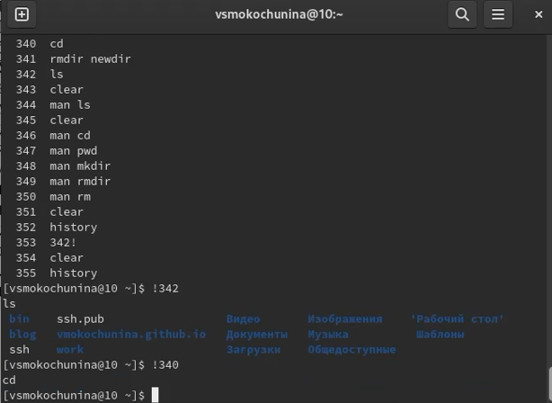{#fig:023 width=70%}

# Контрольные вопросы

1. Что такое командная строка?
Командная строка (консоль или Терминал) – это специальная программа, которая позволяет управлять компьютером путем ввода текстовых команд с клавиатуры.
2. При помощи какой команды можно определить абсолютный путь текущего каталога?
Приведите пример.
Команда pwd. Для определения абсолютного пути к текущему каталогу используется
команда pwd (print working directory).
Пример (абсолютное имя текущего каталога пользователя dharma):
1 pwd
результат:
1 /afs/dk.sci.pfu.edu.ru/home/d/h/dharma
3. При помощи какой команды и каких опций можно определить только тип файлов
и их имена в текущем каталоге? Приведите примеры.
Команда ls сначала выводит список всех файлов (не каталогов), перечисленных в командной строке, а затем выводит список всех файлов, находящихся в каталогах, перечисленных в командной строке. Если не указано ни одного файла, то по умолчанию аргументом назначается . (текущий каталог). Опция -d заставляет ls не считать аргументы-каталоги каталогами. Будут отображаться только файлы, которые не начинаются с . или все файлы, если задана опция -a. 
4. Каким образом отобразить информацию о скрытых файлах? Приведите примеры.
С помощью команды ls -a
5. При помощи каких команд можно удалить файл и каталог? Можно ли это сделать
одной и той же командой? Приведите примеры.
Команда rm. Команда rm используется для удаления файлов и/или каталогов.
Формат команды:
rm [-опции] [файл]
Если требуется, чтобы выдавался запрос подтверждения на удаление файла, то необхо-
димо использовать опцию i.
Чтобы удалить каталог, содержащий файлы, нужно использовать опцию r. Без указания
этой опции команда не будет выполняться.
Пример:
mkdir abs
rm abc
rm -r abc
6. Каким образом можно вывести информацию о последних выполненных пользовате-
лем командах? работы?
ls -t
7. Как воспользоваться историей команд для их модифицированного выполнения? При-
ведите примеры.
history
!1
8. Приведите примеры запуска нескольких команд в одной строке.
Например, мы хотим выполнить сначала одну команду. Затем, когда она отработает (вернет управление в командную строку), нам нужно запустить вторую команду. Для этого служит символ точка с запятой ;. Таким образом, если вы выполните в терминале:
mycommand1; mycommand2; mycommand3
то сначала запустится первая команда mycommand1, а когда управление вернется в терминал, то запустится вторая и так далее.
9. Дайте определение и приведите примера символов экранирования.
Экранирование символов — замена в тексте управляющих символов на соответствующие текстовые подстановки. Один из видов управляющих последовательностей. Экранирование группы символов
В языке программирования python экранирование группы символов в строке осуществляется указанием буквы r (от англ. raw — необработанный) перед строкой, т. е. символы экранируются последовательностями r"экранируемый текст" В вики-разметке экранирование текста осуществляется с помощью псевдотегов <nowiki> и </nowiki>. Если нужно записать сам псевдотег <nowiki>, это делается символами подстановки (&lt;nowiki&gt;).
10. Охарактеризуйте вывод информации на экран после выполнения команды ls с опцией l.
-l - выводить подробный список, в котором будет отображаться владелец, группа, дата создания, размер и другие параметры;
11. Что такое относительный путь к файлу? Приведите примеры использования относи-
тельного и абсолютного пути при выполнении какой-либо команды.
В случае абсолютной адресации путь к каталогу указывается, начиная с корневого каталога, и далее вниз по дереву папок до требуемого. Так все следующие записи являются абсолютными адресами: /home/pl/Desktop, /boot, /etc/vim. Первый знак слэша (/) обозначает корневой каталог.
12. Как получить информацию об интересующей вас команде?
При относительной адресации путь к каталогу указывается, начиная с текущего каталога (другими словами, относительно текущего каталога). Когда используется относительная адресация, слэш никогда не бывает первым знаком
13. Какая клавиша или комбинация клавиш служит для автоматического дополнения
вводимых команд?
Tab — автоматическое завершение набора имени файла, директории или команды.

# Выводы

Я приобрела практические навыки взаимодействия пользователя с системой по-
средством командной строки.

