---
## Front matter
lang: ru-RU
title: Отчёт по лабораторной работе
subtitle: Анализ файловой системы Linux. Команды для работы с файлами и каталогами
author: Мокочунина Влада Сергеевна
institute:
  - Российский университет дружбы народов, Москва, Россия
date: 10 марта 2023

## i18n babel
babel-lang: russian
babel-otherlangs: english

## Formatting pdf
toc: false
toc-title: Содержание
slide_level: 2
aspectratio: 169
section-titles: true
theme: metropolis
header-includes:
 - \metroset{progressbar=frametitle,sectionpage=progressbar,numbering=fraction}
 - '\makeatletter'
 - '\beamer@ignorenonframefalse'
 - '\makeatother'
---

# Информация

## Докладчик

:::::::::::::: {.columns align=center}
::: {.column width="70%"}

  * Мокочунина Влада Сергеевна
  * Российский университет дружбы народов
  * [vmokochunina@gmail.com](mailto:vmokochunina@gmail.com)
  * <https://github.com/Vmokochunina/study_2022-2023_os-intro.git>

:::
::: {.column width="30%"}
:::
::::::::::::::

# Вводная часть

## Актуальность

Умение пользоваться командами для работы с файлами и каталогами

## Объект и предмет исследования

Команды для работы с файлами и каталогами

## Цели и задачи

Ознакомиться с файловой системой Linux, её структурой, именами и содержанием
каталогов. Приобрести практические навыков по применению команд для работы
с файлами и каталогами, по управлению процессами (и работами), по проверке исполь-
зования диска и обслуживанию файловой системы.

## Материалы и методы

терминал,команды

# Создание презентации

## Скопировала файл ~/abc1 в файл april и в файл.

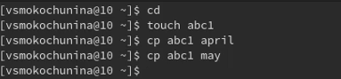{#fig:001 width=70%}

## Скопировала файлы april и may в каталог monthly

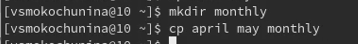{#fig:002 width=70%}

## Скопировала файл monthly/may в файл с именем june

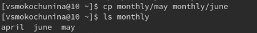{#fig:003 width=70%}

## Скопировала каталог monthly в каталог monthly.00

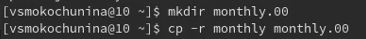{#fig:004 width=70%}

## Скопировала каталог monthly.00 в каталог /tmp

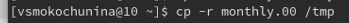{#fig:005 width=70%}

## Изменила название файла april на july в домашнем каталоге

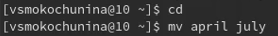{#fig:006 width=70%}

## Переместила файл july в каталог monthly.00

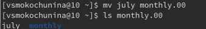{#fig:007 width=70%}

## Переименовала каталог monthly.00 в monthly.01

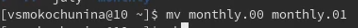{#fig:008 width=70%}

## Переместила каталог monthly.01в каталог reports

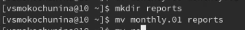{#fig:009 width=70%}

## Переименовала каталог reports/monthly.01 в reports/monthly

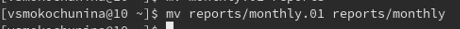{#fig:010 width=70%}

## Создала файл ~/may с правом выполнения для владельца

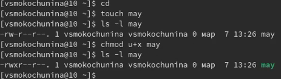{#fig:011 width=70%}

## Лишила владельца файла ~/may права на выполнение

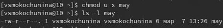{#fig:012 width=70%}

## Создала каталог monthly с запретом на чтение для членов группы и всех остальных пользователей

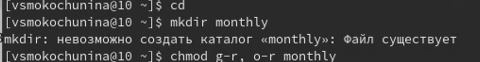{#fig:013 width=70%}

## Создала файл ~/abc1 с правом записи для членов группы

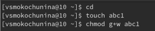{#fig:014 width=70%}

## Скопировала файл /usr/include/sys/io.h в домашний каталог и назовите его equipment.

{#fig:015 width=70%}

## В домашнем каталоге создала директорию ~/ski.plases.

{#fig:016 width=70%}

## Переместила файл equipment в каталог ~/ski.plases.

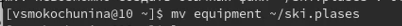{#fig:017 width=70%}

## Переименовала файл ~/ski.plases/equipment в ~/ski.plases/equiplist.

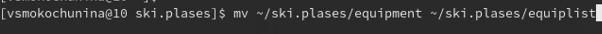{#fig:018 width=70%}

## Создала в домашнем каталоге файл abc1 и скопировала его в каталог ~/ski.plases, назвав его equiplist2.

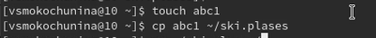{#fig:019 width=70%}

## Создала каталог с именем equipment в каталоге ~/ski.plases.

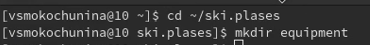{#fig:020 width=70%}

## Переместила файлы ~/ski.plases/equiplist и equiplist2 в каталог ~/ski.plases/equipment.

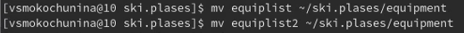{#fig:021 width=70%}

## Создала и переместила каталог ~/newdir в каталог ~/ski.plases и назвала его plans.

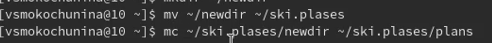{#fig:022 width=70%}

## Опции команды chmod, необходимые для того, чтобы присвоить перечисленным ниже файлам выделенные права доступа, считая, что в начале таких прав нет
3.1. drwxr--r-- ... australia
3.2. drwx--x--x ... play
3.3. -r-xr--r-- ... my_os
3.4. -rw-rw-r-- ... feathers
При необходимости создала нужные файлы.

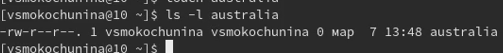{#fig:023 width=70%}

## Просмотрела содержимое файла /etc/password.

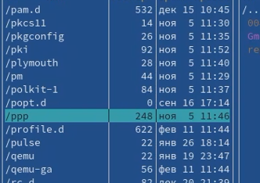{#fig:024 width=70%}

## Скопировала файл ~/feathers в файл ~/file.old.

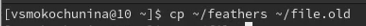{#fig:025 width=70%}

## Переместила файл ~/file.old в каталог ~/play.

{#fig:026 width=70%}

## Скопировала каталог ~/play в каталог ~/fun.

{#fig:027 width=70%}

## Переместила каталог ~/fun в каталог ~/play и назвала его games.

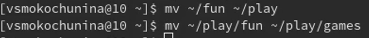{#fig:028 width=70%}

## Лишила владельца файла ~/feathers права на чтение.

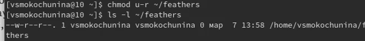{#fig:029 width=70%}

## Попыталась просмотреть файл ~/feathers командой cat, но было отказано в доступе,тк я лишила себя прав на чтение

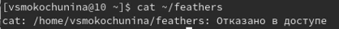{#fig:030 width=70%}

## Попыталась скопировать файл ~/feathers,но было отказано в доступе,тк я лишила себя прав на чтение

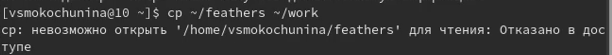{#fig:031 width=70%}

## Дала владельцу файла ~/feathers право на чтение.

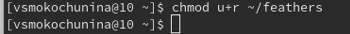{#fig:032 width=70%}

## Лишила владельца каталога ~/play права на выполнение.

{#fig:033 width=70%}

## Перешла в каталог ~/play, но было отказано в доступе,тк я лишила себя прав на выполнение

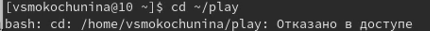{#fig:034 width=70%}

## Дала владельцу каталога ~/play право на выполнение.

{#fig:035 width=70%}

## Прочитала man по командам mount, fsck, mkfs, kill

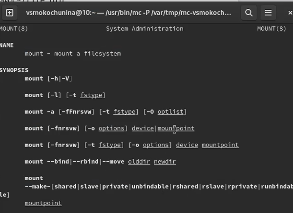{#fig:036 width=70%}

Команда mount в линуксе является очень гибким инструментом в руках системного администратора. С помощью команды mount можно подключить сетевой диск, раздел жесткого диска или USB-накопитель.

##

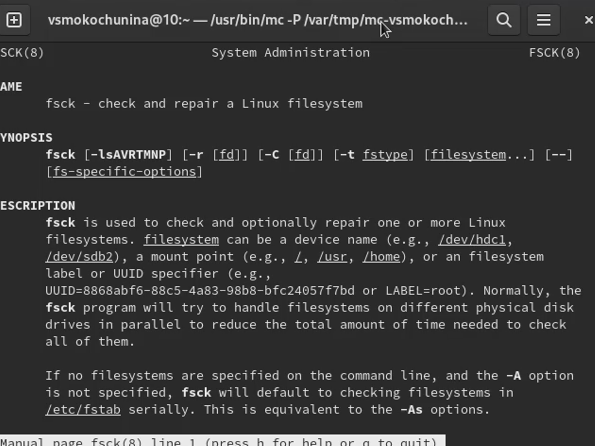{#fig:037 width=70%}

Утилита Linux fsck (File System Consistency Check - проверка согласованности файловой системы) проверяет файловые системы на наличие ошибок или нерешенных проблем. Инструмент используется для исправления потенциальных ошибок и создания отчетов.

##

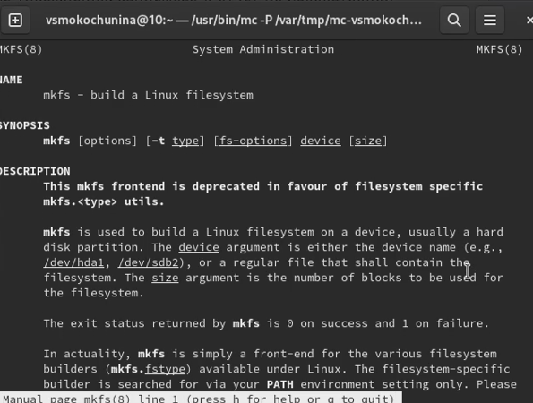{#fig:038 width=70%}

mkfs используется для создания файловой системы Linux на некотором устройстве, обычно в разделе жёсткого диска. В качестве аргумента filesys для файловой системы может выступать или название устройства (например, /dev/hda1, /dev/sdb2) или точка монтирования (например, /, /usr, /home). Аргументом blocks указывается количество блоков, которые выделяются для использования этой файловой системой. 

##

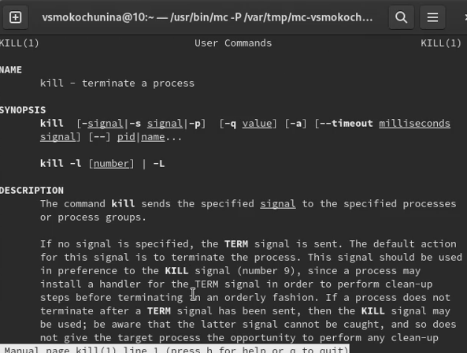{#fig:039 width=70%}

Команда kill является встроенной командой командной оболочки, предназначенной для отправки системных сигналов определенным процессам. Команда принимает числовые идентификаторы процессов, а также числовые или текстовые идентификаторы сигналов. Чаще всего данная команда используется для принудительного завершения работы определенных процессов.

## Результаты

Я ознакомилась с файловой системой Linux, её структурой, именами и содержанием
каталогов. Приобрела практические навыков по применению команд для работы
с файлами и каталогами, по управлению процессами (и работами), по проверке исполь-
зования диска и обслуживанию файловой системы.

## 

Спасибо за внимание!

:::

