---
## Front matter
title: "Отчёт по лабораторной работе"
subtitle: "Анализ файловой системы Linux. Команды для работы с файлами и каталогами"
author: "Мокочунина Влада Сергеевна"

## Generic otions
lang: ru-RU
toc-title: "Содержание"

## Bibliography
bibliography: bib/cite.bib
csl: pandoc/csl/gost-r-7-0-5-2008-numeric.csl

## Pdf output format
toc: true # Table of contents
toc-depth: 2
lof: true # List of figures
lot: true # List of tables
fontsize: 12pt
linestretch: 1.5
papersize: a4
documentclass: scrreprt
## I18n polyglossia
polyglossia-lang:
  name: russian
  options:
	- spelling=modern
	- babelshorthands=true
polyglossia-otherlangs:
  name: english
## I18n babel
babel-lang: russian
babel-otherlangs: english
## Fonts
mainfont: PT Serif
romanfont: PT Serif
sansfont: PT Sans
monofont: PT Mono
mainfontoptions: Ligatures=TeX
romanfontoptions: Ligatures=TeX
sansfontoptions: Ligatures=TeX,Scale=MatchLowercase
monofontoptions: Scale=MatchLowercase,Scale=0.9
## Biblatex
biblatex: true
biblio-style: "gost-numeric"
biblatexoptions:
  - parentracker=true
  - backend=biber
  - hyperref=auto
  - language=auto
  - autolang=other*
  - citestyle=gost-numeric
## Pandoc-crossref LaTeX customization
figureTitle: "Рис."
tableTitle: "Таблица"
listingTitle: "Листинг"
lofTitle: "Список иллюстраций"
lotTitle: "Список таблиц"
lolTitle: "Листинги"
## Misc options
indent: true
header-includes:
  - \usepackage{indentfirst}
  - \usepackage{float} # keep figures where there are in the text
  - \floatplacement{figure}{H} # keep figures where there are in the text
---

# Цель работы

Ознакомление с файловой системой Linux, её структурой, именами и содержанием
каталогов. Приобретение практических навыков по применению команд для работы
с файлами и каталогами, по управлению процессами (и работами), по проверке исполь-
зования диска и обслуживанию файловой системы.

# Задание

Ознакомиться с файловой системой Linux, её структурой, именами и содержанием
каталогов. Приобрести практические навыков по применению команд для работы
с файлами и каталогами, по управлению процессами (и работами), по проверке исполь-
зования диска и обслуживанию файловой системы.

# Выполнение лабораторной работы

1. Скопировала файл ~/abc1 в файл april и в файл (рис. [-@fig:001]).

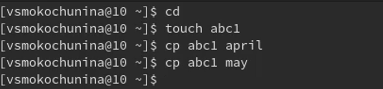{#fig:001 width=70%}

2. Скопировала файлы april и may в каталог monthly

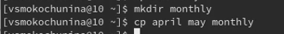{#fig:002 width=70%}

3. Скопировала файл monthly/may в файл с именем june

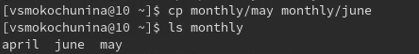{#fig:003 width=70%}

4. Скопировала каталог monthly в каталог monthly.00

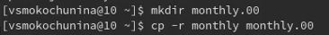{#fig:004 width=70%}

5. Скопировала каталог monthly.00 в каталог /tmp

{#fig:005 width=70%}

6. Изменила название файла april на july в домашнем каталоге

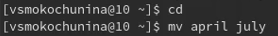{#fig:006 width=70%}

7. Переместила файл july в каталог monthly.00

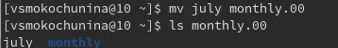{#fig:007 width=70%}

8. Переименовала каталог monthly.00 в monthly.01

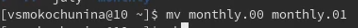{#fig:008 width=70%}

9. Переместила каталог monthly.01в каталог reports

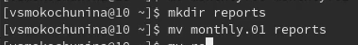{#fig:009 width=70%}

10. Переименовала каталог reports/monthly.01 в reports/monthly

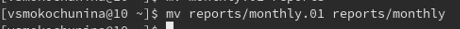{#fig:010 width=70%}

11. Создала файл ~/may с правом выполнения для владельца

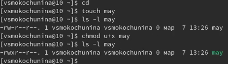{#fig:011 width=70%}

12. Лишила владельца файла ~/may права на выполнение

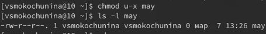{#fig:012 width=70%}

13. Создала каталог monthly с запретом на чтение для членов группы и всех остальных пользователей

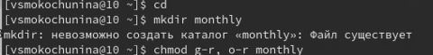{#fig:013 width=70%}

14. Создала файл ~/abc1 с правом записи для членов группы

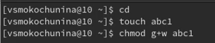{#fig:014 width=70%}

15. Скопировала файл /usr/include/sys/io.h в домашний каталог и назовите его equipment.

{#fig:015 width=70%}

16. В домашнем каталоге создала директорию ~/ski.plases.

{#fig:016 width=70%}

17. Переместила файл equipment в каталог ~/ski.plases.

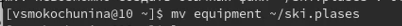{#fig:017 width=70%}

18. Переименовала файл ~/ski.plases/equipment в ~/ski.plases/equiplist.

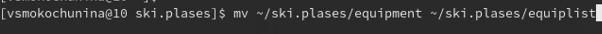{#fig:018 width=70%}

19. Создала в домашнем каталоге файл abc1 и скопировала его в каталог ~/ski.plases, назвав его equiplist2.

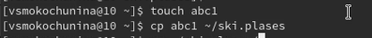{#fig:019 width=70%}

20. Создала каталог с именем equipment в каталоге ~/ski.plases.

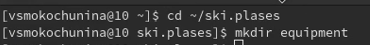{#fig:020 width=70%}

21. Переместила файлы ~/ski.plases/equiplist и equiplist2 в каталог ~/ski.plases/equipment.

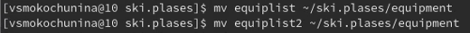{#fig:021 width=70%}

22. Создала и переместила каталог ~/newdir в каталог ~/ski.plases и назвала его plans.

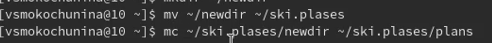{#fig:022 width=70%}

23. Опции команды chmod, необходимые для того, чтобы присвоить перечисленным ниже файлам выделенные права доступа, считая, что в начале таких прав нет
3.1. drwxr--r-- ... australia
3.2. drwx--x--x ... play
3.3. -r-xr--r-- ... my_os
3.4. -rw-rw-r-- ... feathers
При необходимости создала нужные файлы.

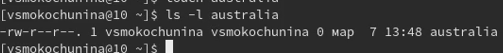{#fig:023 width=70%}

24. Просмотрела содержимое файла /etc/password.

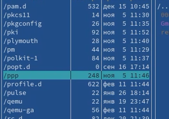{#fig:024 width=70%}

25. Скопировала файл ~/feathers в файл ~/file.old.

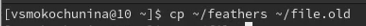{#fig:025 width=70%}

26. Переместила файл ~/file.old в каталог ~/play.

{#fig:026 width=70%}

27. Скопировала каталог ~/play в каталог ~/fun.

{#fig:027 width=70%}

28. Переместила каталог ~/fun в каталог ~/play и назвала его games.

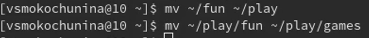{#fig:028 width=70%}

29. Лишила владельца файла ~/feathers права на чтение.

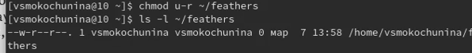{#fig:029 width=70%}

30. Попыталась просмотреть файл ~/feathers командой cat, но было отказано в доступе,тк я лишила себя прав на чтение

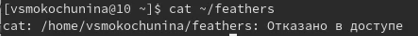{#fig:030 width=70%}

31. Попыталась скопировать файл ~/feathers,но было отказано в доступе,тк я лишила себя прав на чтение

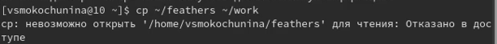{#fig:031 width=70%}

32. Дала владельцу файла ~/feathers право на чтение.

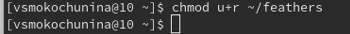{#fig:032 width=70%}

33. Лишила владельца каталога ~/play права на выполнение.

{#fig:033 width=70%}

34. Перешла в каталог ~/play, но было отказано в доступе,тк я лишила себя прав на выполнение

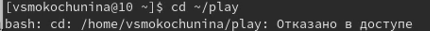{#fig:034 width=70%}

35. Дала владельцу каталога ~/play право на выполнение.

{#fig:035 width=70%}

36. Прочитала man по командам mount, fsck, mkfs, kill

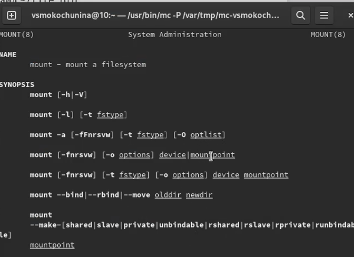{#fig:036 width=70%}

Команда mount в линуксе является очень гибким инструментом в руках системного администратора. С помощью команды mount можно подключить сетевой диск, раздел жесткого диска или USB-накопитель.

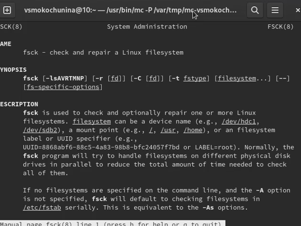{#fig:037 width=70%}

Утилита Linux fsck (File System Consistency Check - проверка согласованности файловой системы) проверяет файловые системы на наличие ошибок или нерешенных проблем. Инструмент используется для исправления потенциальных ошибок и создания отчетов.

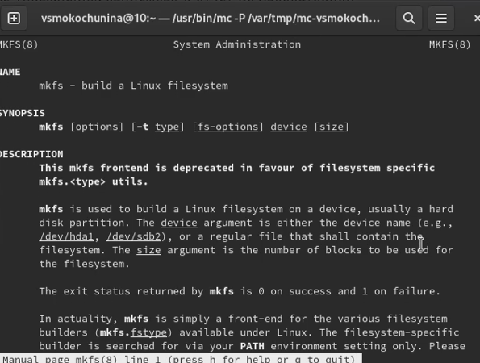{#fig:038 width=70%}

mkfs используется для создания файловой системы Linux на некотором устройстве, обычно в разделе жёсткого диска. В качестве аргумента filesys для файловой системы может выступать или название устройства (например, /dev/hda1, /dev/sdb2) или точка монтирования (например, /, /usr, /home). Аргументом blocks указывается количество блоков, которые выделяются для использования этой файловой системой. 

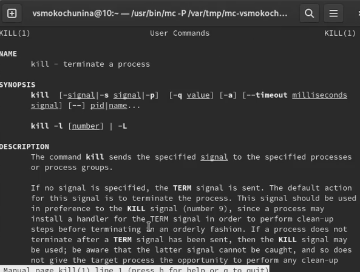{#fig:039 width=70%}

Команда kill является встроенной командой командной оболочки, предназначенной для отправки системных сигналов определенным процессам. Команда принимает числовые идентификаторы процессов, а также числовые или текстовые идентификаторы сигналов. Чаще всего данная команда используется для принудительного завершения работы определенных процессов.

# Контрольные вопросы

1. Дайте характеристику каждой файловой системе, существующей на жёстком диске
компьютера, на котором вы выполняли лабораторную работу.
Ext2, Ext3, Ext4 или Extended Filesystem - это стандартная файловая система для Linux. Она была разработана еще для Minix. Она самая стабильная из всех существующих, кодовая база изменяется очень редко и эта файловая система содержит больше всего функций. Версия ext2 была разработана уже именно для Linux и получила много улучшений. В 2001 году вышла ext3, которая добавила еще больше стабильности благодаря использованию журналирования. В 2006 была выпущена версия ext4, которая используется во всех дистрибутивах Linux до сегодняшнего дня. В ней было внесено много улучшений, в том числе увеличен максимальный размер раздела до одного экзабайта.

JFS или Journaled File System была разработана в IBM для AIX UNIX и использовалась в качестве альтернативы для файловых систем ext. Сейчас она используется там, где необходима высокая стабильность и минимальное потребление ресурсов. При разработке файловой системы ставилась цель создать максимально эффективную файловую систему для многопроцессорных компьютеров. Также как и ext, это журналируемая файловая система, но в журнале хранятся только метаданные, что может привести к использованию старых версий файлов после сбоев.

ReiserFS - была разработана намного позже, в качестве альтернативы ext3 с улучшенной производительностью и расширенными возможностями. Она была разработана под руководством Ганса Райзера и поддерживает только Linux. Из особенностей можно отметить динамический размер блока, что позволяет упаковывать несколько небольших файлов в один блок, что предотвращает фрагментацию и улучшает работу с небольшими файлами. Еще одно преимущество - в возможности изменять размеры разделов на лету. Но минус в некоторой нестабильности и риске потери данных при отключении энергии. Раньше ReiserFS применялась по умолчанию в SUSE Linux, но сейчас разработчики перешли на Btrfs.

XFS - это высокопроизводительная файловая система, разработанная в Silicon Graphics для собственной операционной системы еще в 2001 году. Она изначально была рассчитана на файлы большого размера, и поддерживала диски до 2 Терабайт. Из преимуществ файловой системы можно отметить высокую скорость работы с большими файлами, отложенное выделение места, увеличение разделов на лету и незначительный размер служебной информации.

XFS - журналируемая файловая система, однако в отличие от ext, в журнал записываются только изменения метаданных. Она используется по умолчанию в дистрибутивах на основе Red Hat. Из недостатков - это невозможность уменьшения размера, сложность восстановления данных и риск потери файлов при записи, если будет неожиданное отключение питания, поскольку большинство данных находится в памяти.

Btrfs или B-Tree File System - это совершенно новая файловая система, которая сосредоточена на отказоустойчивости, легкости администрирования и восстановления данных. Файловая система объединяет в себе очень много новых интересных возможностей, таких как размещение на нескольких разделах, поддержка подтомов, изменение размера не лету, создание мгновенных снимков, а также высокая производительность. Но многими пользователями файловая система Btrfs считается нестабильной. Тем не менее, она уже используется как файловая система по умолчанию в OpenSUSE и SUSE Linux.
2. Приведите общую структуру файловой системы и дайте характеристику каждой ди-
ректории первого уровня этой структуры.
/ — root каталог. Содержит в себе всю иерархию системы;

/bin — здесь находятся двоичные исполняемые файлы. Основные общие команды, хранящиеся отдельно от других программ в системе (прим.: pwd, ls, cat, ps);

/boot — тут расположены файлы, используемые для загрузки системы (образ initrd, ядро vmlinuz);

/dev — в данной директории располагаются файлы устройств (драйверов). С помощью этих файлов можно взаимодействовать с устройствами. К примеру, если это жесткий диск, можно подключить его к файловой системе. В файл принтера же можно написать напрямую и отправить задание на печать;

/etc — в этой директории находятся файлы конфигураций программ. Эти файлы позволяют настраивать системы, сервисы, скрипты системных демонов;

/home — каталог, аналогичный каталогу Users в Windows. Содержит домашние каталоги учетных записей пользователей (кроме root). При создании нового пользователя здесь создается одноименный каталог с аналогичным именем и хранит личные файлы этого пользователя;

/lib — содержит системные библиотеки, с которыми работают программы и модули ядра;

/lost+found — содержит файлы, восстановленные после сбоя работы системы. Система проведет проверку после сбоя и найденные файлы можно будет посмотреть в данном каталоге;

/media — точка монтирования внешних носителей. Например, когда вы вставляете диск в дисковод, он будет автоматически смонтирован в директорию /media/cdrom;

/mnt — точка временного монтирования. Файловые системы подключаемых устройств обычно монтируются в этот каталог для временного использования;

/opt — тут расположены дополнительные (необязательные) приложения. Такие программы обычно не подчиняются принятой иерархии и хранят свои файлы в одном подкаталоге (бинарные, библиотеки, конфигурации);

/proc — содержит файлы, хранящие информацию о запущенных процессах и о состоянии ядра ОС;

/root — директория, которая содержит файлы и личные настройки суперпользователя;

/run — содержит файлы состояния приложений. Например, PID-файлы или UNIX-сокеты;

/sbin — аналогично /bin содержит бинарные файлы. Утилиты нужны для настройки и администрирования системы суперпользователем;
3. Какая операция должна быть выполнена, чтобы содержимое некоторой файловой
системы было доступно операционной системе?
Монтирование тома.
4. Назовите основные причины нарушения целостности файловой системы. Как устра-
нить повреждения файловой системы?
Отсутствие синхронизации между образом файловой системы в памяти и ее данными на диске в случае аварийного останова может привести к появлению следующих ошибок:

Один блок адресуется несколькими mode (принадлежит нескольким файлам).

Блок помечен как свободный, но в то же время занят (на него ссылается onode).

Блок помечен как занятый, но в то же время свободен (ни один inode на него не ссылается).

Неправильное число ссылок в inode (недостаток или избыток ссылающихся записей в каталогах).

Несовпадение между размером файла и суммарным размером адресуемых inode блоков.

Недопустимые адресуемые блоки (например, расположенные за пределами файловой системы).

"Потерянные" файлы (правильные inode, на которые не ссылаются записи каталогов).

Недопустимые или неразмещенные номера inode в записях каталогов.
5. Как создаётся файловая система?
mkfs - позволяет создать файловую систему Linux.
6. Дайте характеристику командам для просмотра текстовых файлов.
Cat - выводит содержимое файла на стандартное устройство вывода
7. Приведите основные возможности команды cp в Linux.
Cp – копирует или перемещает директорию, файлы.
8. Приведите основные возможности команды mv в Linux.
Mv - переименовать или переместить файл или директорию
9. Что такое права доступа? Как они могут быть изменены?
Права доступа к файлу или каталогу можно изменить, воспользовавшись командой chmod. Сделать это может владелец файла (или каталога) или пользователь с правами администратора.

# Выводы

Я ознакомилась с файловой системой Linux, её структурой, именами и содержанием
каталогов. Приобрела практические навыков по применению команд для работы
с файлами и каталогами, по управлению процессами (и работами), по проверке исполь-
зования диска и обслуживанию файловой системы.

