---
## Front matter
lang: ru-RU
title: Отчёт по лабораторной работе №6
subtitle: Поиск файлов. Перенаправление ввода-вывода. Просмотр запущенных процессов
author:
 Мокочунина Влада Сергеевна
institute:
  - Российский университет дружбы народов, Москва, Россия
date: 13 февраля 2023

## i18n babel
babel-lang: russian
babel-otherlangs: english

## Formatting pdf
toc: false
toc-title: Содержание
slide_level: 2
aspectratio: 169
section-titles: true
theme: metropolis
header-includes:
 - \metroset{progressbar=frametitle,sectionpage=progressbar,numbering=fraction}
 - '\makeatletter'
 - '\beamer@ignorenonframefalse'
 - '\makeatother'
---

# Информация

## Докладчик

:::::::::::::: {.columns align=center}
::: {.column width="70%"}

  * Мокочунина Влада Сергеевна
  * Российский университет дружбы народов
  * [vmokochunina@gmail.com](mailto:vmokochunina@gmail.com)
  * <https://github.com/Vmokochunina/study_2022-2023_os-intro.git>

:::
::: {.column width="30%"}
:::
::::::::::::::

# Вводная часть

## Актуальность

Умение управлять процессами 

## Объект и предмет исследования

Процессы

## Цели и задачи

Ознакомление с инструментами поиска файлов и фильтрации текстовых данных.
Приобретение практических навыков: по управлению процессами (и заданиями), по
проверке использования диска и обслуживанию файловых систем.

## Материалы и методы

Команды

## Осуществление входа в систему(рис. [-@fig:001])

{#fig:001 width=70%}

## Запись в файл file.txt названия файлов, содержащихся в каталоге /etc. Дописала в этот же файл названия файлов, содержащихся в вашем домашнем каталоге.

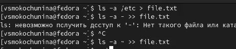{#fig:002 width=70%}

## Вывела имена всех файлов из file.txt, имеющих расширение .conf, после чего записала их в новый текстовой файл conf.txt.

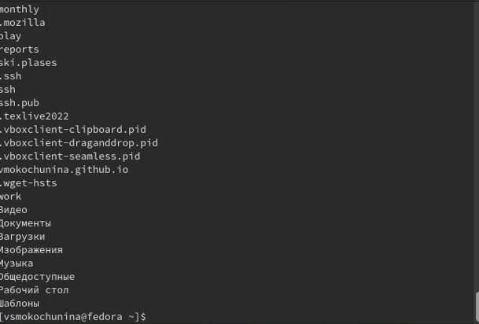{#fig:003 width=70%}

##

{#fig:004 width=70%}

##

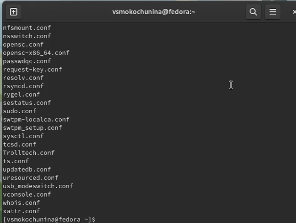{#fig:005 width=70%}

## Определила, какие файлы в домашнем каталоге имеют имена, начинавшиеся
с символа c

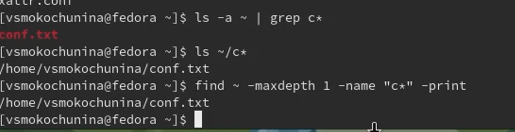{#fig:006 width=70%}

## Вывела на экран (по странично) имена файлов из каталога /etc, начинающиеся
с символа h.

{#fig:007 width=70%}

##

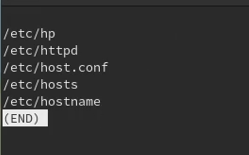{#fig:008 width=70%}

## Запустила в фоновом режиме процесс, который будет записывать в файл ~/logfile
файлы, имена которых начинаются с log.

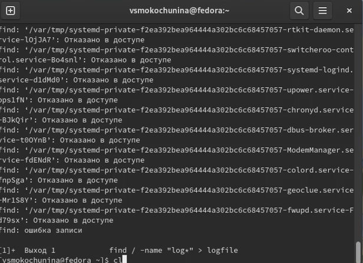{#fig:009 width=70%}

##

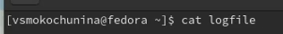{#fig:010 width=70%}

##

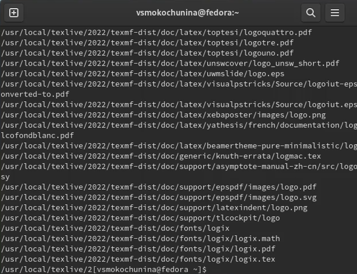{#fig:011 width=70%}

## Удалила файл ~/logfile.

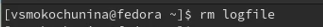{#fig:012 width=70%}

## Запустила из консоли в фоновом режиме редактор gedit. Определила идентификатор процесса gedit, используя команду ps, конвейер и фильтр grep.

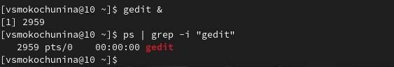{#fig:013 width=70%}

## Прочитала справку (man) команды kill, после чего использовала её для завершения
процесса gedit.

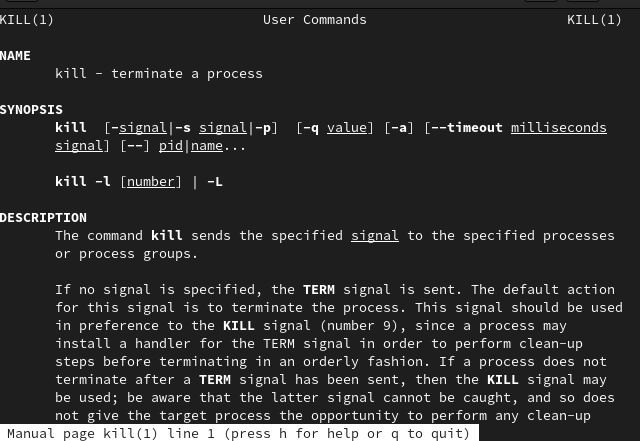{#fig:014 width=70%}

##

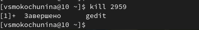{#fig:015 width=70%}

## Выполнила команды df и du, предварительно получив более подробную информацию об этих командах, с помощью команды man.

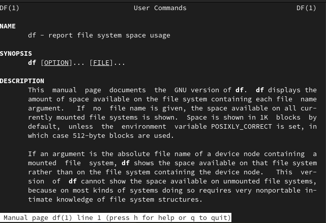{#fig:016 width=70%}

##

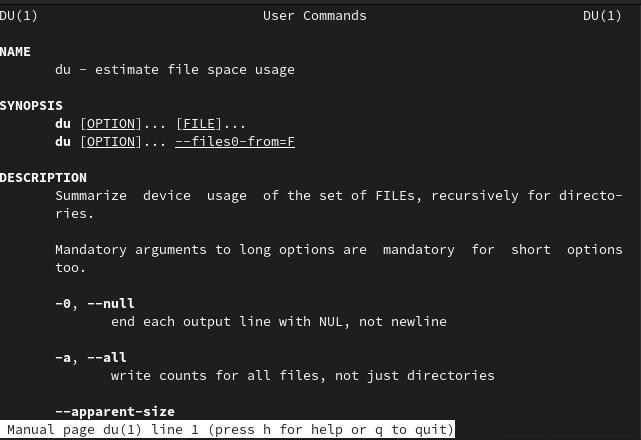{#fig:017 width=70%}

##

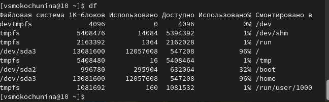{#fig:018 width=70%}

##

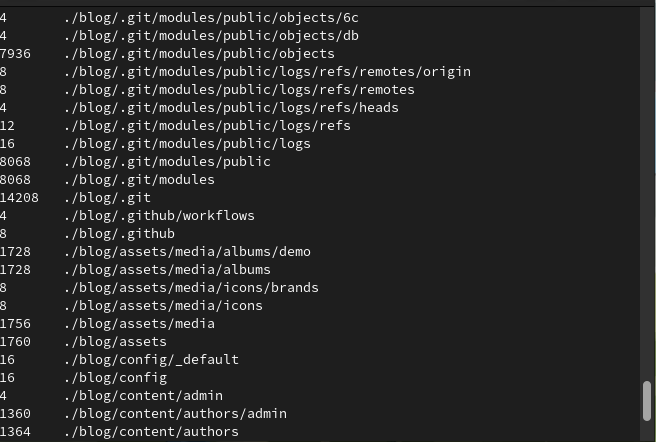{#fig:019 width=70%}

## Воспользовавшись справкой команды find, вывела имена всех директорий, имеющихся в домашнем каталоге.

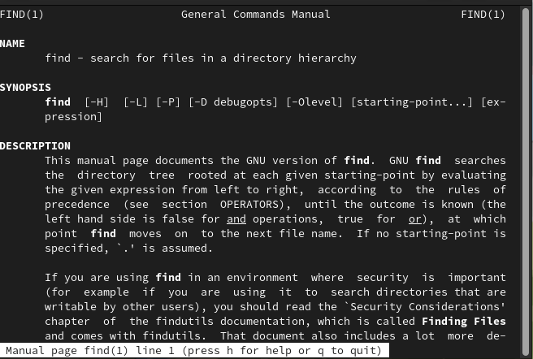{#fig:020 width=70%}

##

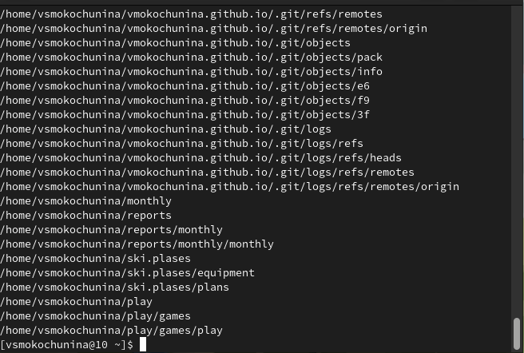{#fig:021 width=70%}

# Результаты

Я ознакомилась с инструментами поиска файлов и фильтрации текстовых данных.
Приобрела практические навыки: по управлению процессами (и заданиями), по
проверке использования диска и обслуживанию файловых систем.

## 

Спасибо за внимание!
