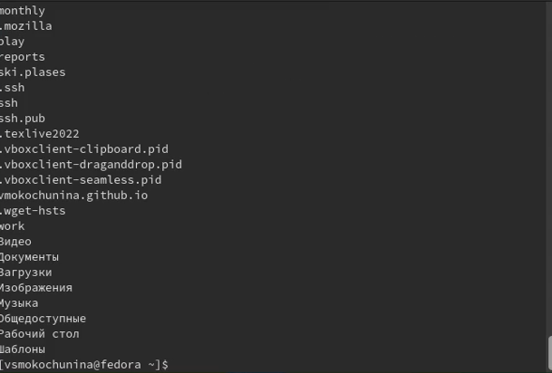

---
## Front matter
title: "Отчёт по лабораторной работе №6"
subtitle: "Поиск файлов. Перенаправление ввода-вывода. Просмотр запущенных процессов"
author: "Мокочунина Влада Сергеевна"

## Generic otions
lang: ru-RU
toc-title: "Содержание"

## Bibliography
bibliography: bib/cite.bib
csl: pandoc/csl/gost-r-7-0-5-2008-numeric.csl

## Pdf output format
toc: true # Table of contents
toc-depth: 2
lof: true # List of figures
lot: true # List of tables
fontsize: 12pt
linestretch: 1.5
papersize: a4
documentclass: scrreprt
## I18n polyglossia
polyglossia-lang:
  name: russian
  options:
	- spelling=modern
	- babelshorthands=true
polyglossia-otherlangs:
  name: english
## I18n babel
babel-lang: russian
babel-otherlangs: english
## Fonts
mainfont: PT Serif
romanfont: PT Serif
sansfont: PT Sans
monofont: PT Mono
mainfontoptions: Ligatures=TeX
romanfontoptions: Ligatures=TeX
sansfontoptions: Ligatures=TeX,Scale=MatchLowercase
monofontoptions: Scale=MatchLowercase,Scale=0.9
## Biblatex
biblatex: true
biblio-style: "gost-numeric"
biblatexoptions:
  - parentracker=true
  - backend=biber
  - hyperref=auto
  - language=auto
  - autolang=other*
  - citestyle=gost-numeric
## Pandoc-crossref LaTeX customization
figureTitle: "Рис."
tableTitle: "Таблица"
listingTitle: "Листинг"
lofTitle: "Список иллюстраций"
lotTitle: "Список таблиц"
lolTitle: "Листинги"
## Misc options
indent: true
header-includes:
  - \usepackage{indentfirst}
  - \usepackage{float} # keep figures where there are in the text
  - \floatplacement{figure}{H} # keep figures where there are in the text
---

# Цель работы

Ознакомление с инструментами поиска файлов и фильтрации текстовых данных.
Приобретение практических навыков: по управлению процессами (и заданиями), по
проверке использования диска и обслуживанию файловых систем.

# Задание

Ознакомиться с инструментами поиска файлов и фильтрации текстовых данных.
Приобрести практические навыки: по управлению процессами (и заданиями), по
проверке использования диска и обслуживанию файловых систем.

# Выполнение лабораторной работы

1. Осуществление входа в систему(рис. [-@fig:001])

{#fig:001 width=70%}

2. Запись в файл file.txt названия файлов, содержащихся в каталоге /etc. Дописала в этот же файл названия файлов, содержащихся в вашем домашнем каталоге.

{#fig:002 width=70%}

3. Вывела имена всех файлов из file.txt, имеющих расширение .conf, после чего записала их в новый текстовой файл conf.txt.

{#fig:003 width=70%}

{#fig:004 width=70%}

{#fig:005 width=70%}

4. Определила, какие файлы в домашнем каталоге имеют имена, начинавшиеся
с символа c

{#fig:006 width=70%}

5. Вывела на экран (по странично) имена файлов из каталога /etc, начинающиеся
с символа h.

{#fig:007 width=70%}

{#fig:008 width=70%}

6. Запустила в фоновом режиме процесс, который будет записывать в файл ~/logfile
файлы, имена которых начинаются с log.

{#fig:009 width=70%}

{#fig:010 width=70%}

{#fig:011 width=70%}

7. Удалила файл ~/logfile.

{#fig:012 width=70%}

8. Запустила из консоли в фоновом режиме редактор gedit. Определила идентификатор процесса gedit, используя команду ps, конвейер и фильтр grep.

{#fig:013 width=70%}

9. Прочитала справку (man) команды kill, после чего использовала её для завершения
процесса gedit.

{#fig:014 width=70%}

{#fig:015 width=70%}

10. Выполнила команды df и du, предварительно получив более подробную информацию об этих командах, с помощью команды man.

{#fig:016 width=70%}

{#fig:017 width=70%}

{#fig:018 width=70%}

{#fig:019 width=70%}

11. Воспользовавшись справкой команды find, вывела имена всех директорий, имеющихся в домашнем каталоге.

{#fig:020 width=70%}

{#fig:021 width=70%}

# Ответы на контрольные вопросы

1. Какие потоки ввода вывода вы знаете?
Разделяют два вида потоков ввода/вывода: байтовые и символьные.
2. Объясните разницу между операцией > и >>.
    > : Перезаписывает существующий файл или создает файл, если файл с указанным именем отсутствует в каталоге.
    >> : добавляет существующий файл или создает файл, если файл с указанным именем отсутствует в каталоге.
3. Что такое конвейер?
Конвейер (англ. pipeline) в терминологии операционных систем семейства Unix — некоторое множество процессов, для которых выполнено следующее перенаправление ввода-вывода: то, что выводит на поток стандартного вывода предыдущий процесс, попадает в поток стандартного ввода следующего процесса.
4. Что такое процесс? Чем это понятие отличается от программы?
Компьютерная программа сама по себе — лишь пассивная последовательность инструкций. В то время как процесс — непосредственное выполнение этих инструкций. Также, процессом называют выполняющуюся программу и все её элементы: адресное пространство, глобальные переменные, регистры, стек, открытые файлы и так далее.
5. Что такое PID и GID?
Идентификатор родительского процесса (PPID).
Новый процесс создается путем клонирования одного из уже существующих процессов.
Исходный процесс в терминологии UNIX называется родительским, а его клон -
порожденным. Помимо собственного идентификатора, каждый процесс имеет атрибут
PPID, т.е. идентификатор своего родительского процесса.
 Идентификатор группы GID и эффективный идентификатор группы (EGID)
GID - это идентификационный номер группы данного процесса. EGID связан с GID
также, как EUID с UID.
6. top − это консольная программа, которая показывает список
работающих процессов в системе. Программа в реальном времени
отсортирует запущенные процессы по их нагрузке на процессор.
htop − это продвинутый консольный мониторинг процессов. Утилита
выводит постоянно меняющийся список системных процессов, который
сортируется в зависимости от нагрузки на ЦПУ. Если делать сравнение с
top, то htop показывает абсолютно все процессы в системе, время их
непрерывного использования, загрузку процессоров и расход оперативной
памяти
7. find − это команда для поиска файлов и каталогов на основе специальных
условий. Ее можно использовать в различных обстоятельствах, например,
для поиска файлов по разрешениям, владельцам, группам, типу, размеру и
другим подобным критериям.
Команда find имеет такой синтаксис:
find [папка] [параметры] критерий шаблон [действие]
Папка − каталог в котором будем искать
Параметры − дополнительные параметры, например, глубина поиска, и т д
Критерий − по какому критерию будем искать: имя, дата создания, права,
владелец и т д.
Шаблон – непосредственно значение по которому будем отбирать файлы.
Основные параметры:
 -P никогда не открывать символические ссылки
 -L - получает информацию о файлах по символическим ссылкам. Важно
для дальнейшей обработки, чтобы обрабатывалась не ссылка, а сам файл.
 -maxdepth - максимальная глубина поиска по подкаталогам, для поиска
только в текущем каталоге установите 1.
 -depth - искать сначала в текущем каталоге, а потом в подкаталогах
 -mount искать файлы только в этой файловой системе.
 -version - показать версию утилиты find
 -print - выводить полные имена файлов
 -type f - искать только файлы
 -type d - поиск папки в Linux
Основные критерии:
 -name - поиск файлов по имени
 -perm - поиск файлов в Linux по режиму доступа
 -user - поиск файлов по владельцу
 -group - поиск по группе
 -mtime - поиск по времени модификации файла
 -atime - поиск файлов по дате последнего чтения
 -nogroup - поиск файлов, не принадлежащих ни одной группе
 -nouser - поиск файлов без владельцев
 -newer - найти файлы новее чем указанный
 -size - поиск файлов в Linux по их размеру
Примеры:
find ~ -type d поиск директорий в домашнем каталоге
find ~ -type f -name ".*" поиск скрытых файлов в домашнем каталоге
8. Файл по его содержимому можно найти с помощью команды grep: «grep
-r "слово/выражение, которое нужно найти"».
9. Утилита df, позволяет проанализировать свободное пространство на
всех подключенных к системе разделах.
10. При выполнении команды du (без указания папки и опции) можно
получить все файлы и папки текущей директории с их размерами. Для
домашнего каталога: du ~/
11. Основные сигналы (каждый сигнал имеет свой номер), которые
используются для завершения процесса:
 SIGINT – самый безобидный сигнал завершения, означает Interrupt.
Он отправляется процессу, запущенному из терминала с помощью
сочетания клавиш Ctrl+C. Процесс правильно завершает все свои действия
и возвращает управление;
 SIGQUIT – это еще один сигнал, который отправляется с помощью
сочетания клавиш, программе, запущенной в терминале. Он сообщает ей
что нужно завершиться и программа может выполнить корректное
завершение или проигнорировать сигнал. В отличие от предыдущего, она
генерирует дамп памяти. Сочетание клавиш Ctrl+/;
 SIGHUP – сообщает процессу, что соединение с управляющим
терминалом разорвано, отправляется, в основном, системой при разрыве
соединения с интернетом;
 SIGTERM – немедленно завершает процесс, но обрабатывается
программой, поэтому позволяет ей завершить дочерние процессы и
освободить все ресурсы;
 SIGKILL – тоже немедленно завершает процесс, но, в отличие от
предыдущего варианта, он не передается самому процессу, а
обрабатывается ядром. Поэтому ресурсы и дочерние процессы остаются
запущенными.
Также для передачи сигналов процессам в Linux используется утилита kill,
её синтаксис: kill [-сигнал] [pid_процесса] (PID – уникальный
идентификатор процесса). Сигнал представляет собой один из выше
перечисленных сигналов для завершения процесса

# Выводы

Я ознакомилась с инструментами поиска файлов и фильтрации текстовых данных.
Приобрела практические навыки: по управлению процессами (и заданиями), по
проверке использования диска и обслуживанию файловых систем.
