---
## Front matter
lang: ru-RU
title: Отчёт по лабораторной работе №7
subtitle: Командная оболочка Midnight Commander
author:
  - Мокочунина Влада Сергеевна
institute:
  - Российский университет дружбы народов, Москва, Россия
date: 25 марта 2023

## i18n babel
babel-lang: russian
babel-otherlangs: english

## Formatting pdf
toc: false
toc-title: Содержание
slide_level: 2
aspectratio: 169
section-titles: true
theme: metropolis
header-includes:
 - \metroset{progressbar=frametitle,sectionpage=progressbar,numbering=fraction}
 - '\makeatletter'
 - '\beamer@ignorenonframefalse'
 - '\makeatother'
---

# Информация

## Докладчик

:::::::::::::: {.columns align=center}
::: {.column width="70%"}

  * Мокочунина Влада Сергеевна
  * Российский университет дружбы народов
  * [vmokochunina@gmail.com](mailto:vmokochunina@gmail.com)
  * <https://github.com/Vmokochunina/study_2022-2023_os-intro.git>

:::
::: {.column width="30%"}
:::
::::::::::::::

# Вводная часть

## Цели и задачи

Освоение основных возможностей командной оболочки Midnight Commander. Приобретение навыков практической работы по просмотру каталогов и файлов; манипуляций с ними.

# Создание презентации

## Изучила информацию о mc, вызвав в командной строке man mc. (рис. [-@fig:001]).

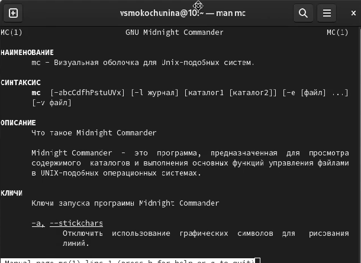{#fig:001 width=70%}

## Запустила из командной строки mc, изучила его структуру и меню.

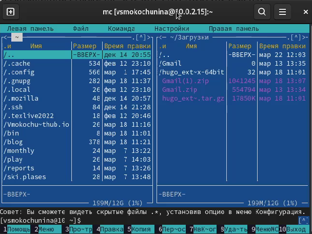{#fig:002 width=70%}

## Выполнила несколько операций в mc, используя управляющие клавиши.

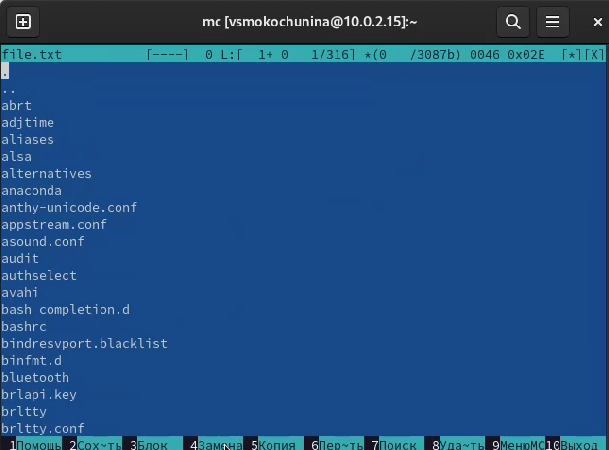{#fig:003 width=70%}

##

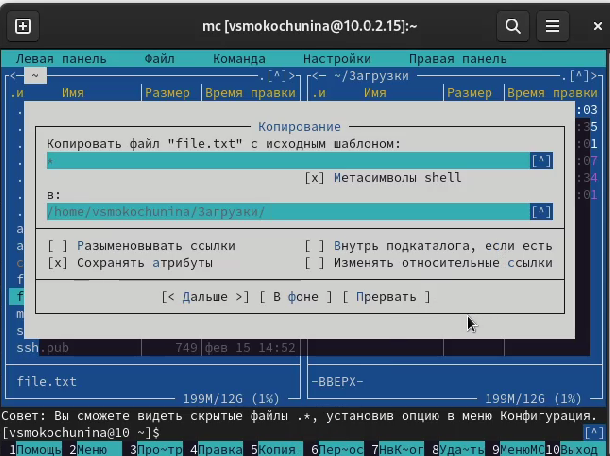{#fig:004 width=70%}

##

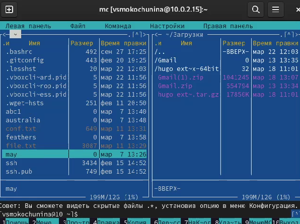{#fig:005 width=70%}

## Выполнила основные команды меню левой, правой панели. 

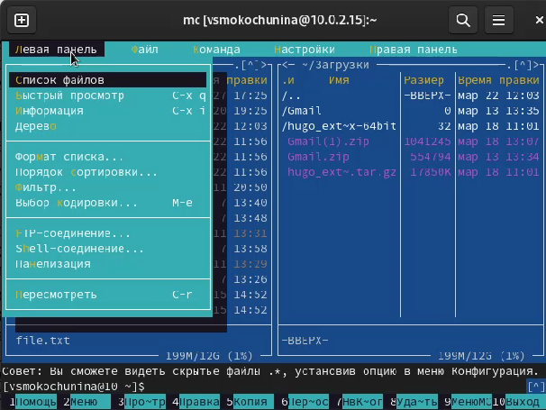{#fig:006 width=70%}

##

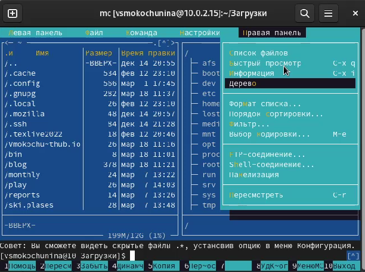{#fig:007 width=70%}

## Использовала возможности подменю Файл.

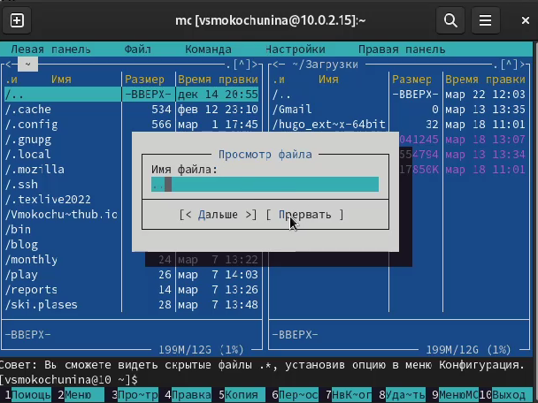{#fig:008 width=70%}

##

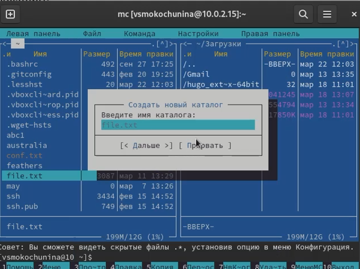{#fig:009 width=70%}

##

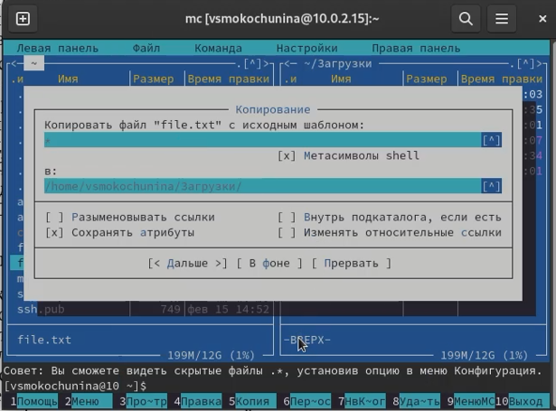{#fig:010 width=70%}

## Воспользовалась подменю Команда.

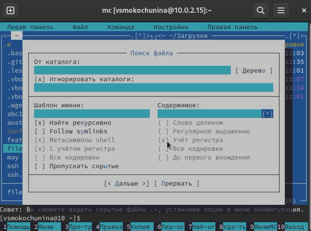{#fig:011 width=70%}

##

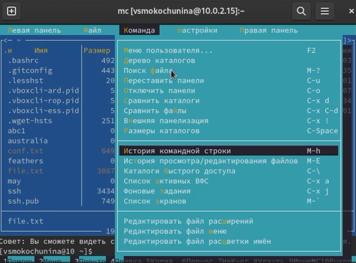{#fig:012 width=70%}

## Вызвала подменю Настройки . Освоила операции

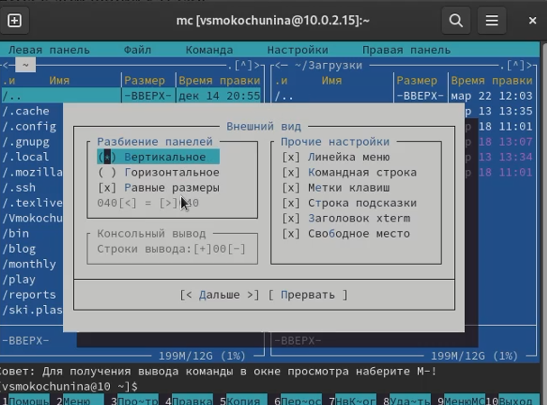{#fig:013 width=70%}

# Задание по встроенному редактору mc

## Создала текстовой файл text.txt.

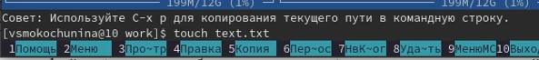{#fig:014 width=70%}

## Открыла этот файл с помощью встроенного в mc редактора.

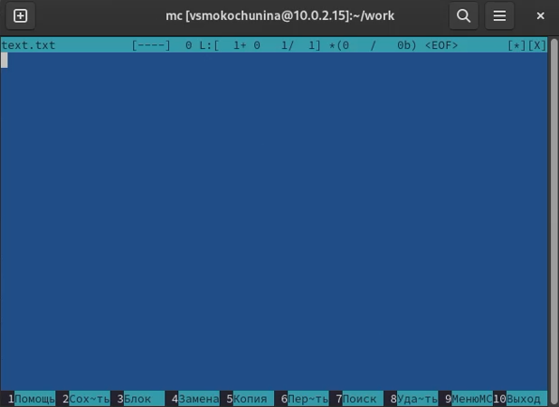{#fig:015 width=70%}

## Вставила в открытый файл небольшой фрагмент текста.

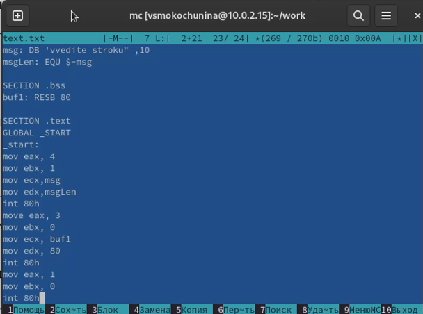{#fig:016 width=70%}

## Проделала с текстом следующие манипуляции, используя горячие клавиши:
4.1. Удалила строку текста.

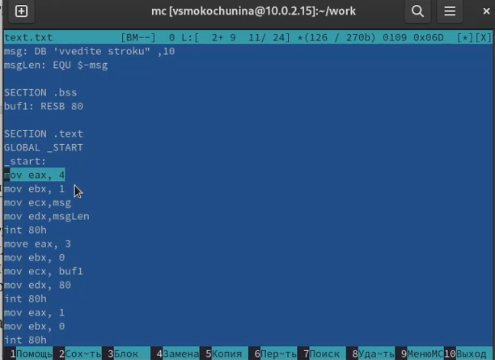{#fig:017 width=70%}

##

4.2. Выделила фрагмент текста и скопировала его на новую строку.

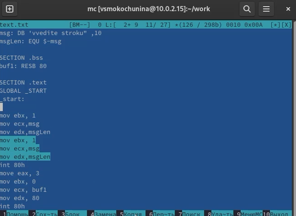{#fig:018 width=70%}

##

4.3. Выделила фрагмент текста и перенесла его на новую строку.

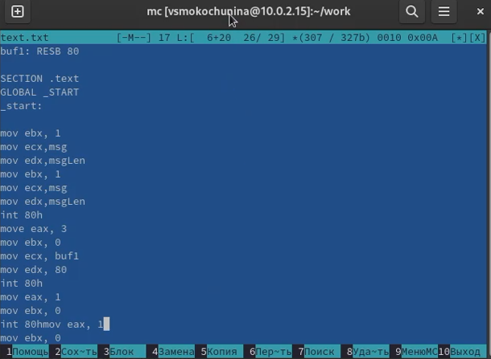{#fig:019 width=70%}

##

4.4. Сохранила файл.

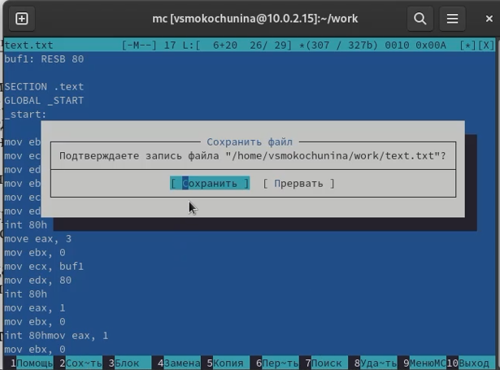{#fig:020 width=70%}

##

4.5. Отменила последнее действие.

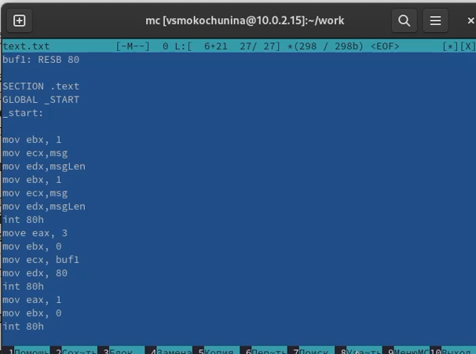{#fig:021 width=70%}

##

4.6. Перешла в конец файла и написала некоторый текст.

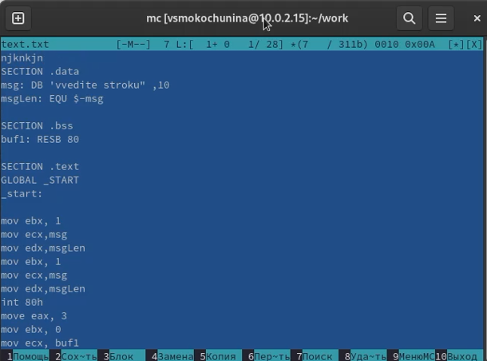{#fig:022 width=70%}

##

4.7. Перешла в начало файла и написала некоторый текст.

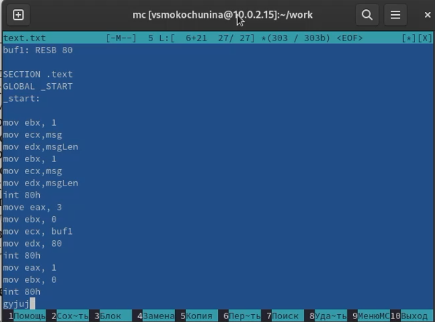{#fig:023 width=70%}

##

4.8. Сохранила и закрыла файл.

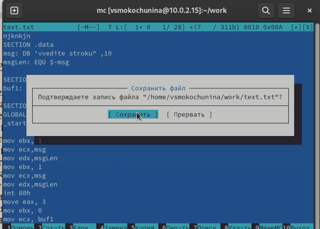{#fig:024 width=70%}

# Результаты

Освоила основные возможности командной оболочки Midnight Commander. Приобрела навыки практической работы по просмотру каталогов и файлов; манипуляций с ними.

## Итоговый слайд

Спасибо за внимание!

