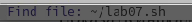

---
## Front matter
title: "Отчёт по лабораторной работе №9"
subtitle: "Текстовой редактор emacs"
author: "Мокочунина Влада сергеевна"

## Generic otions
lang: ru-RU
toc-title: "Содержание"

## Bibliography
bibliography: bib/cite.bib
csl: pandoc/csl/gost-r-7-0-5-2008-numeric.csl

## Pdf output format
toc: true # Table of contents
toc-depth: 2
lof: true # List of figures
lot: true # List of tables
fontsize: 12pt
linestretch: 1.5
papersize: a4
documentclass: scrreprt
## I18n polyglossia
polyglossia-lang:
  name: russian
  options:
	- spelling=modern
	- babelshorthands=true
polyglossia-otherlangs:
  name: english
## I18n babel
babel-lang: russian
babel-otherlangs: english
## Fonts
mainfont: PT Serif
romanfont: PT Serif
sansfont: PT Sans
monofont: PT Mono
mainfontoptions: Ligatures=TeX
romanfontoptions: Ligatures=TeX
sansfontoptions: Ligatures=TeX,Scale=MatchLowercase
monofontoptions: Scale=MatchLowercase,Scale=0.9
## Biblatex
biblatex: true
biblio-style: "gost-numeric"
biblatexoptions:
  - parentracker=true
  - backend=biber
  - hyperref=auto
  - language=auto
  - autolang=other*
  - citestyle=gost-numeric
## Pandoc-crossref LaTeX customization
figureTitle: "Рис."
tableTitle: "Таблица"
listingTitle: "Листинг"
lofTitle: "Список иллюстраций"
lotTitle: "Список таблиц"
lolTitle: "Листинги"
## Misc options
indent: true
header-includes:
  - \usepackage{indentfirst}
  - \usepackage{float} # keep figures where there are in the text
  - \floatplacement{figure}{H} # keep figures where there are in the text
---

# Цель работы

Познакомиться с операционной системой Linux. Получить практические навыки рабо-
ты с редактором Emacs.

# Задание

Познакомиться с операционной системой Linux. Получить практические навыки рабо-
ты с редактором Emacs.

# Выполнение лабораторной работы

1. Открыла emacs. (рис. [-@fig:001]).

{#fig:001 width=70%}

2. Создала файл lab07.sh с помощью комбинации Ctrl-x Ctrl-f (C-x C-f).

{#fig:002 width=70%}

3. Набрала текст

{#fig:003 width=70%}

4. Сохранила файл с помощью комбинации Ctrl-x Ctrl-s (C-x C-s).

{#fig:004 width=70%}

5. Вырезала одной командой целую строку (С-k).

{#fig:005 width=70%}

6. Вставила эту строку в конец файла (C-y).

{#fig:006 width=70%}

7. Выделила область текста (C-space).

{#fig:007 width=70%}

8. Скопировала область в буфер обмена (M-w).

{#fig:008 width=70%}

9. Вставила область в конец файла.

{#fig:009 width=70%}

10. Вновь выделила эту область и на этот раз вырезала её (C-w).

{#fig:010 width=70%}

11. Отменила последнее действие (C-/).

{#fig:011 width=70%}

12. Переместила курсор в начало строки (C-a).

{#fig:012 width=70%}

13. Переместила курсор в конец строки (C-e).

{#fig:013 width=70%}

14. Переместила курсор в начало буфера (M-<).

{#fig:014 width=70%}

15. Переместила курсор в конец буфера (M->).

{#fig:015 width=70%}

16. Вывела список активных буферов на экран (C-x C-b).

{#fig:016 width=70%}

17. Переместилась во вновь открытое окно (C-x) o со списком открытых буферов
и переключилась на другой буфер.

{#fig:017 width=70%}

18. Закрыла это окно (C-x 0).

{#fig:018 width=70%}

19. Теперь вновь переключилась между буферами, но уже без вывода их списка на
экран (C-x b).

{#fig:019 width=70%}

20. Поделила фрейм на 4 части: разделила фрейм на два окна по вертикали (C-x 3),
а затем каждое из этих окон на две части по горизонтали (C-x 2)

{#fig:020 width=70%}

21. В каждом из четырёх созданных окон открыла новый буфер (файл) и ввела
несколько строк текста.

{#fig:021 width=70%}

22. Переключилась в режим поиска (C-s) и нащла несколько слов, присутствующих
в тексте.

{#fig:022 width=70%}

23. Переключилась между результатами поиска, нажимая C-s

{#fig:023 width=70%}

# Контрольные вопросы

1) Emacs − один из наиболее мощных и широко распространённых
редакторов, используемых в мире Unix. По популярности он
соперничает с редактором vi и его клонами. В зависимости от ситуации,
Emacs может быть:
 текстовым редактором;
 программой для чтения почты и новостей Usenet;
 интегрированной средой разработки (IDE);
 операционной системой и т.д.
Всё это разнообразие достигается благодаря архитектуре Emacs,
которая позволяет расширять возможности редактора при помощи
языка Emacs Lisp. На языке C написаны лишь самые базовые и
низкоуровневые части Emacs, включая полнофункциональный
интерпретатор языка Lisp. Таким образом, Emacs имеет встроенный
язык программирования, который может использоваться для настройки,
расширения и изменения поведения редактора. В действительности,
большая часть того редактора, с которым пользователи Emacs работают
в наши дни, написана на языке Lisp.
2) Основную трудность для новичков при освоении данного редактора
могут составлять большое количество команд, комбинаций клавиш,
которые не получится все запомнить с первого раза и поэтоу придется
часто обращаться к справочным материалам.
3) Буфер – это объект, представляющий собой текст. Если имеется
несколько буферов, то редактировать можно только один. Обычно буфер
считывает данные из файла или записывает в файл данные из буфера.
Окно – это область экрана, отображающая буфер. При запуске редактора
отображается одно окно, но при обращении к некоторым функциям
могут открыться дополнительные окна. Окна Emacs и окна графической
среды X Window – разные вещи. Одно окно X Window может быть
разбито на несколько окон в смысле Emacs, в каждом из которых
отображается отдельный буфер.
4) Да, можно.
5) При запуске Emacs по умолчанию создаются следующие буферы:
 «scratch» (буфер для несохраненного текста)
 «Messages» (журнал ошибок, включающий также информацию,
которая появляется в области EchoArea)
 «GNU Emacs» (справочный буфер о редакторе)
6) C-c | сначала, удерживая «ctrl», нажимаю «c», после – отпускаю обе
клавиши и нажимаю «|»
C-c C-| сначала, удерживая «ctrl», нажимаю «с», после – отпускаю обе
клавиши и, удерживая «ctrl», нажимаю «|»
7) Чтобы поделить окно на две части необходимо воспользоваться
комбинацией «Ctrl-x 3» (по вертикали) или «Ctrl-x 2» (по горизонтали)
8) Настройки Emacs хранятся в файле .emacs.
9) По умолчанию клавиша «←» удаляет символ перед курсором, но в
редакторе её можно переназначить. Для этого необхдимо изменить
конфигурацию файла .emacs.
10) Более удобным я считаю редактор emacs, потому что в нем проще
открывать другие файлы, можно использовать сразу несколько окон, нет
«Командного режима», «Режима ввода», «Режима командной строки»,
которые являются немного непривычными и в какой-то степени
неудобными.

# Выводы

Я познакомилась с операционной системой Linux, получила практические навыки рабо-
ты с редактором Emacs.

