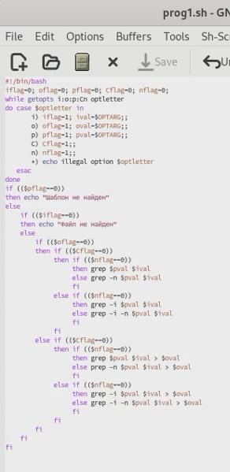
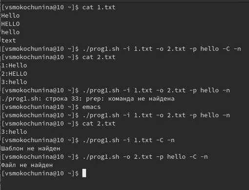
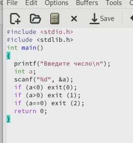
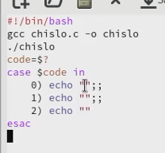
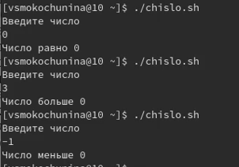
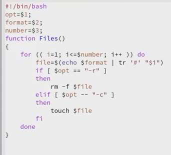
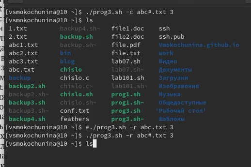
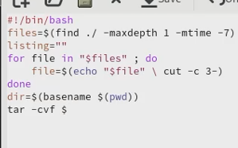
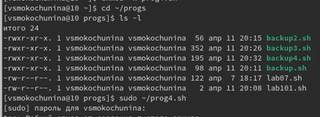

---
## Front matter
lang: ru-RU
title: Отчёт по лабораторной работе №11
subtitle: Программирование в командном процессоре ОС UNIX. Ветвления и циклы
author:
  - Мокочунина В.С.
institute:
  - Российский университет дружбы народов, Москва, Россия
date: 17 апреля 2023

## i18n babel
babel-lang: russian
babel-otherlangs: english

## Formatting pdf
toc: false
toc-title: Содержание
slide_level: 2
aspectratio: 169
section-titles: true
theme: metropolis
header-includes:
 - \metroset{progressbar=frametitle,sectionpage=progressbar,numbering=fraction}
 - '\makeatletter'
 - '\beamer@ignorenonframefalse'
 - '\makeatother'
---

# Информация

## Докладчик

:::::::::::::: {.columns align=center}
::: {.column width="70%"}

  * Мокочунина Влада Сергеевна
  * Российский университет дружбы народов
  * [vmokochunina@gmail.com](mailto:vmokochunina@gmail.com)
  * <https://github.com/Vmokochunina/study_2022-2023_os-intro.git>

:::
::: {.column width="30%"}
:::
::::::::::::::

# Вводная часть

## Цели и задачи

Изучить основы программирования в оболочке ОС UNIX. Научится писать более
сложные командные файлы с использованием логических управляющих конструкций
и циклов.

# Создание презентации

##  Используя команды getopts grep, написала командный файл, который анализирует
командную строку с ключами:
– -iinputfile — прочитать данные из указанного файла;
– -ooutputfile — вывести данные в указанный файл;
– -pшаблон — указать шаблон для поиска;
– -C — различать большие и малые буквы;
– -n — выдавать номера строк.(рис. [-@fig:001]).

{#fig:001 width=70%}

##  Проверила на выполнение

{#fig:002 width=70%}

##  Написала на языке Си программу, которая вводит число и определяет, является ли оно
больше нуля, меньше нуля или равно нулю. Затем программа завершается с помощью
функции exit(n), передавая информацию в о коде завершения в оболочку. Команд-
ный файл должен вызывать эту программу и, проанализировав с помощью команды
$?, выдать сообщение о том, какое число было введено

{#fig:003 width=70%}

##  

{#fig:004 width=70%}

##   Проверила на выполнение

{#fig:005 width=70%}

##   Написала командный файл, создающий указанное число файлов, пронумерованных
последовательно от 1 до 𝑁 (например 1.tmp, 2.tmp, 3.tmp,4.tmp и т.д.). Число файлов,
которые необходимо создать, передаётся в аргументы командной строки. Этот же ко-
мандный файл должен уметь удалять все созданные им файлы (если они существуют).

{#fig:006 width=70%}

##   Проверила на выполнение

{#fig:007 width=70%}

##   Написала командный файл, который с помощью команды tar запаковывает в архив
все файлы в указанной директории. Модифицировала его так, чтобы запаковывались
только те файлы, которые были изменены менее недели тому назад (использовать
команду find).

{#fig:008 width=70%}

##   Проверила на выполнение

{#fig:009 width=70%}

# Результаты

Изучила основы программирования в оболочке ОС UNIX. Научилась писать более
сложные командные файлы с использованием логических управляющих конструкций
и циклов.

## Итоговый слайд

Спасибо за внимание

