---
## Front matter
lang: ru-RU
title: Проект
subtitle: 1 этап
author:
  - Мокочунина В. С.
institute:
  - Российский университет дружбы народов, Москва, Россия
date: 24 февраля 2023

## i18n babel
babel-lang: russian
babel-otherlangs: english

## Formatting pdf
toc: false
toc-title: Содержание
slide_level: 2
aspectratio: 169
section-titles: true
theme: metropolis
header-includes:
 - \metroset{progressbar=frametitle,sectionpage=progressbar,numbering=fraction}
 - '\makeatletter'
 - '\beamer@ignorenonframefalse'
 - '\makeatother'
---

# Информация

## Докладчик

  * Мокочунина Влада Сергеевна
  * студент РУДН направление "Математика и механика"
  * [vmokochunina@gmail.com](mailto:vmokochunina@gmail.com)
  * <https://github.com/Vmokochunina/study_2022-2023_os-intro.git>

# Вводная часть

## Актуальность

Умение создавать сайт

## Объект и предмет исследования

hugo

## Цели и задачи

Создать сайт с личной информацией

## Материалы и методы

hugo

# Создание презентации

## Я скачала файл для генерации сайта

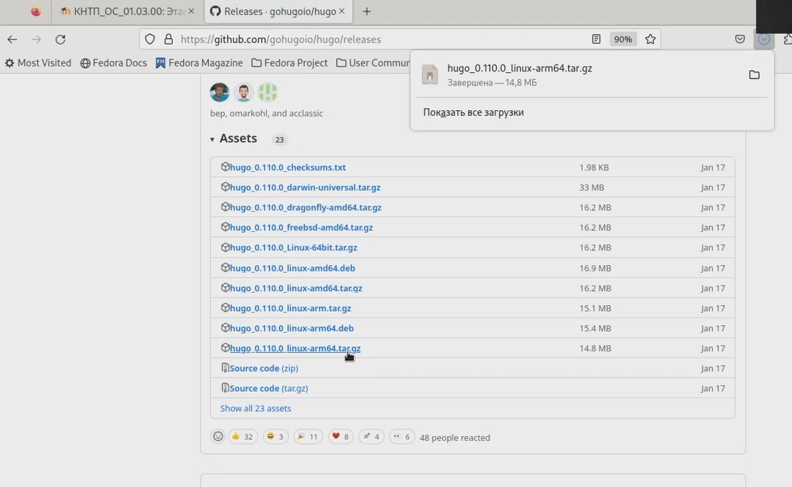{#fig:001 width=70%}

## Распаковка файла

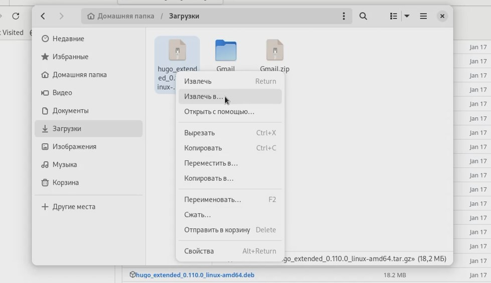{#fig:002 width=70%}

## Создание необходимого каталога

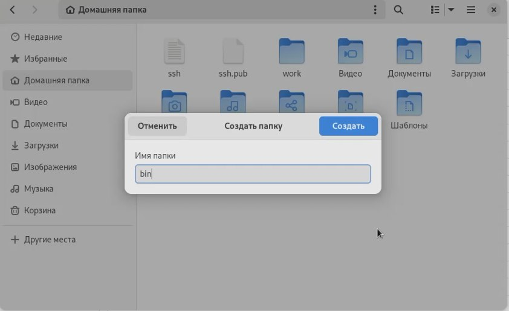{#fig:003 width=70%}

## Создание репозитория по шаблону индивидуального проекта

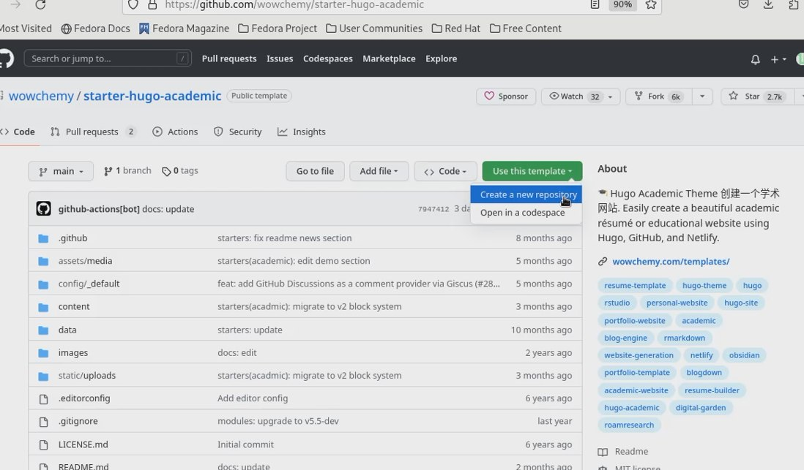{#fig:004 width=70%}

## Клонирование репозитория

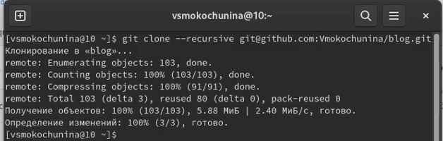{#fig:005 width=70%}

## Перешли в каталог и проверили,что есть все файлы

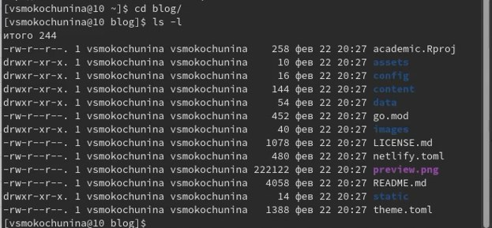{#fig:006 width=70%}

## Установка hugo

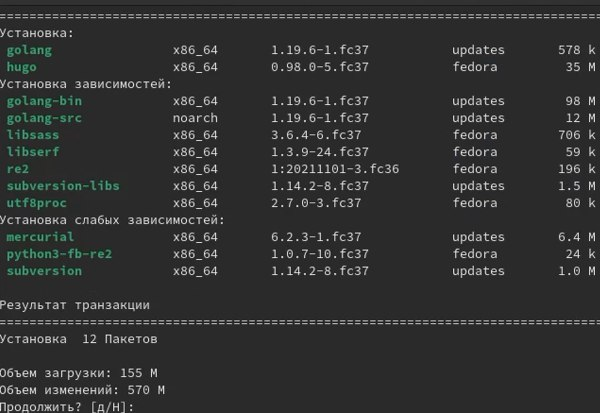{#fig:007 width=70%}

## Проверка создания файла

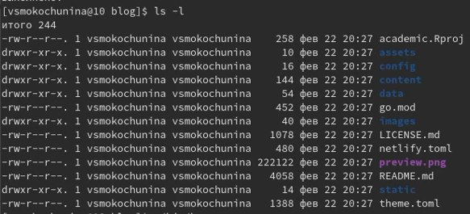{#fig:008 width=70%}

## Выполнение команды ~/bin/hugo

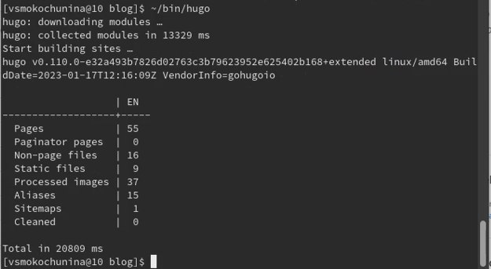{#fig:009 width=70%}

## Проверка создания файла

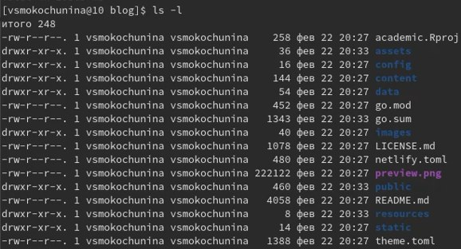{#fig:010 width=70%}

## Удаление ненужного каталога

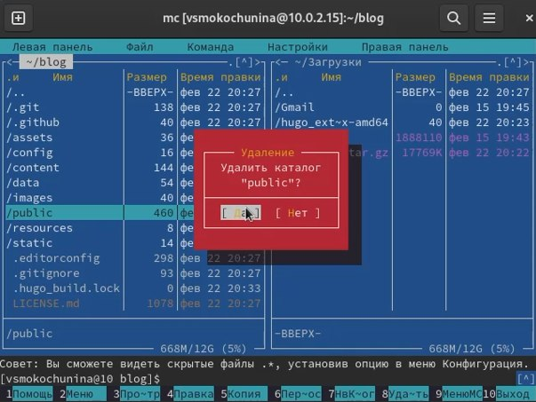{#fig:011 width=70%}

## Выполнение команды ~/bin/hugo server

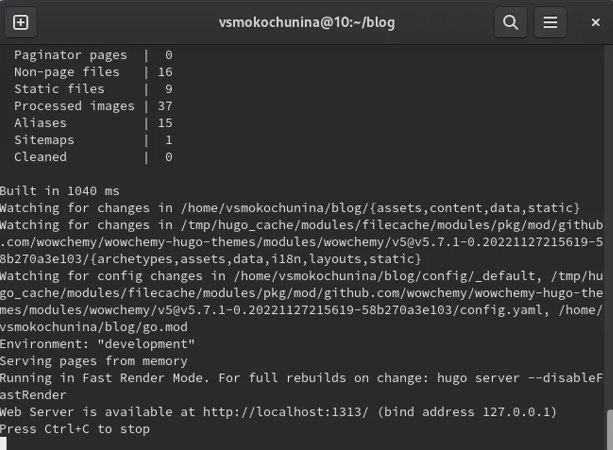{#fig:012 width=70%}

## Скопировав ссылку из терминала,я ввела ее в браузер и открыла сайт

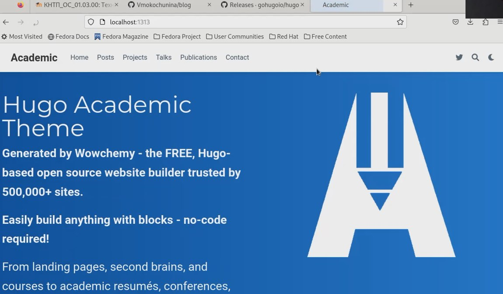{#fig:013 width=70%}

## Чтобы пропал синий фон,я удалила блок из файла md

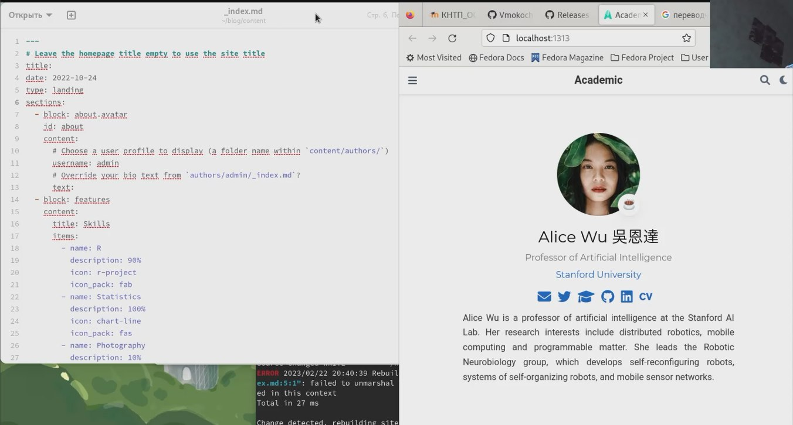{#fig:014 width=70%}

## Создание репозитория

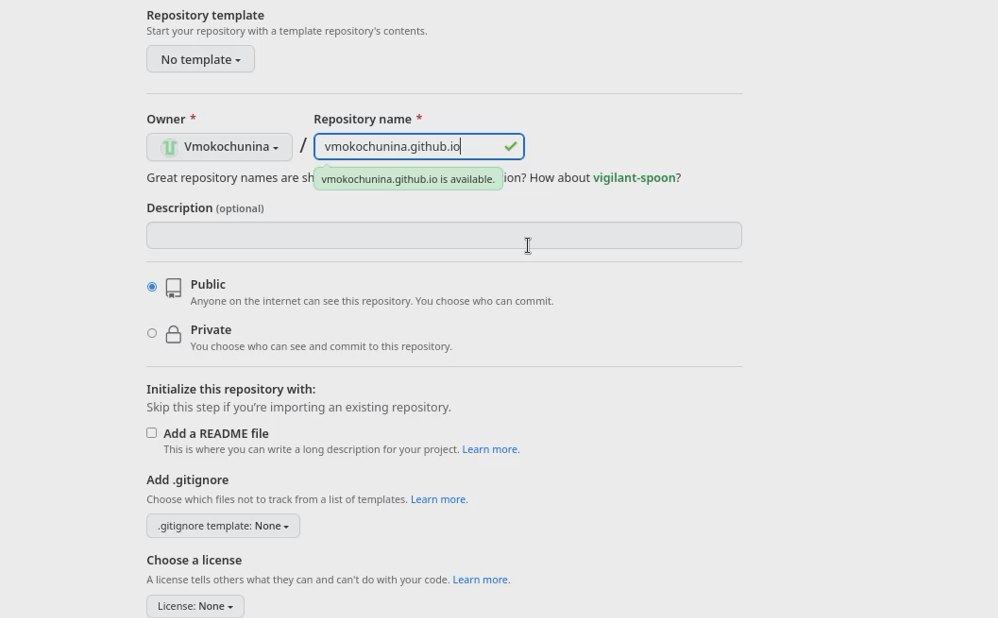{#fig:015 width=70%}

## Проверка файлов

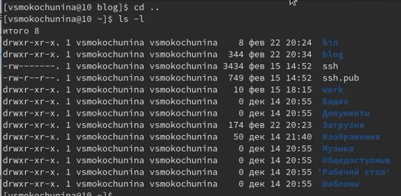{#fig:016 width=70%}

## Клонирование репозитория

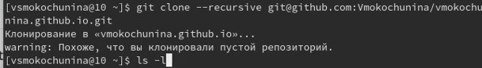{#fig:017 width=70%}

## Проверили,что репозиторий склонировался

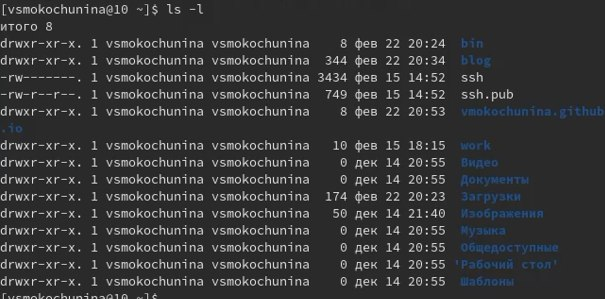{#fig:018 width=70%}

## Переход в созданную папку и переключение на ветку 

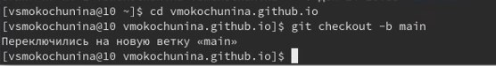{#fig:019 width=70%}

## Создание файла и его отправка на гитхаб

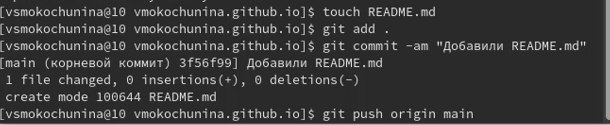{#fig:020 width=70%}

## Видим,что файл перенесся

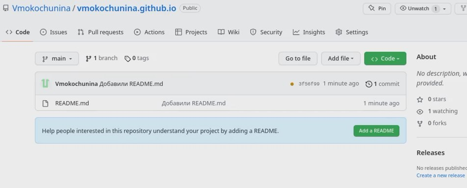{#fig:021 width=70%}

## Выполнение команды подключения репозитория к папке для эффективной генерации сайта

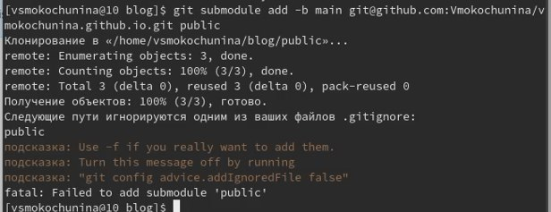{#fig:022 width=70%}

## Исправляем ошибку игнорирования,комментируем public

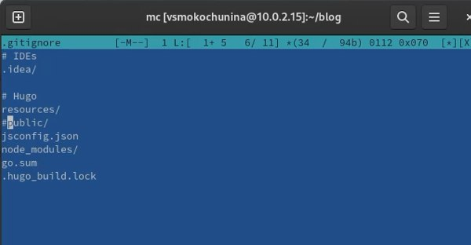{#fig:023 width=70%}

## Снова выполняю команду подключения репозитория к папке для эффективной генерации сайта

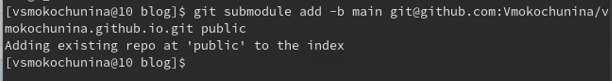{#fig:024 width=70%}

## Создали файлы в папке

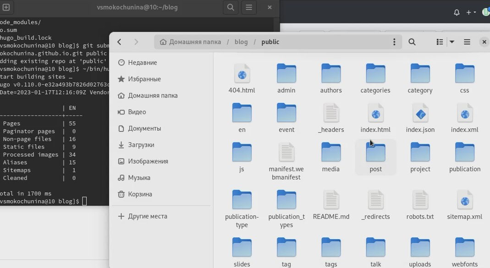{#fig:025 width=70%}

## Отправление файлов на сервер

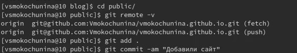{#fig:026 width=70%}

## Видим,что файлы перенеслись

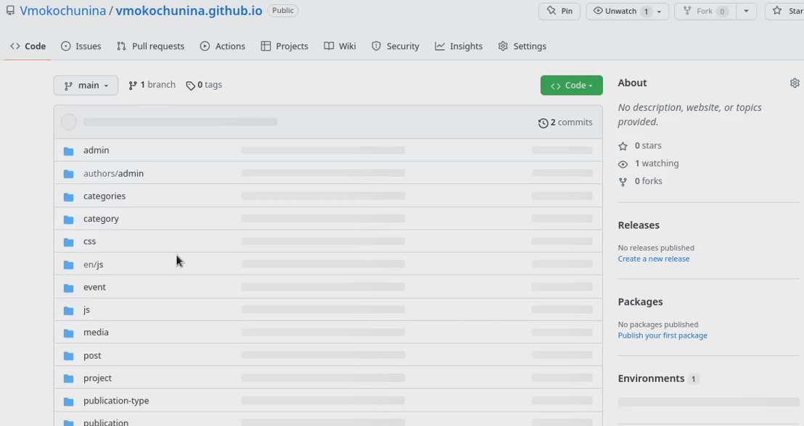{#fig:027 width=70%}

## Копирую ссылку,чтобы проверить привязку к сайту

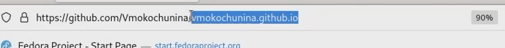{#fig:028 width=70%}

## Сайт открылся

{#fig:029 width=70%}

# Результаты

Я научилась генерировать сайт,привязывать его к собственному репозиторию

# Итог
Спасибо за внимание!
