---
## Front matter
title: "Индивидуальный проект"
subtitle: "1 этап"
author: "Мокочунина Влада Сергеевна"

## Generic otions
lang: ru-RU
toc-title: "Содержание"

## Bibliography
bibliography: bib/cite.bib
csl: pandoc/csl/gost-r-7-0-5-2008-numeric.csl

## Pdf output format
toc: true # Table of contents
toc-depth: 2
lof: true # List of figures
lot: true # List of tables
fontsize: 12pt
linestretch: 1.5
papersize: a4
documentclass: scrreprt
## I18n polyglossia
polyglossia-lang:
  name: russian
  options:
	- spelling=modern
	- babelshorthands=true
polyglossia-otherlangs:
  name: english
## I18n babel
babel-lang: russian
babel-otherlangs: english
## Fonts
mainfont: PT Serif
romanfont: PT Serif
sansfont: PT Sans
monofont: PT Mono
mainfontoptions: Ligatures=TeX
romanfontoptions: Ligatures=TeX
sansfontoptions: Ligatures=TeX,Scale=MatchLowercase
monofontoptions: Scale=MatchLowercase,Scale=0.9
## Biblatex
biblatex: true
biblio-style: "gost-numeric"
biblatexoptions:
  - parentracker=true
  - backend=biber
  - hyperref=auto
  - language=auto
  - autolang=other*
  - citestyle=gost-numeric
## Pandoc-crossref LaTeX customization
figureTitle: "Рис."
tableTitle: "Таблица"
listingTitle: "Листинг"
lofTitle: "Список иллюстраций"
lotTitle: "Список таблиц"
lolTitle: "Листинги"
## Misc options
indent: true
header-includes:
  - \usepackage{indentfirst}
  - \usepackage{float} # keep figures where there are in the text
  - \floatplacement{figure}{H} # keep figures where there are in the text
---

# Цель работы

Создание сайта

# Задание

Сгенерировать сайт, привязать его к личному репозиторию

# Выполнение лабораторной работы

1. Я скачала файл для генерации сайта. (рис. [- @fig:001]).

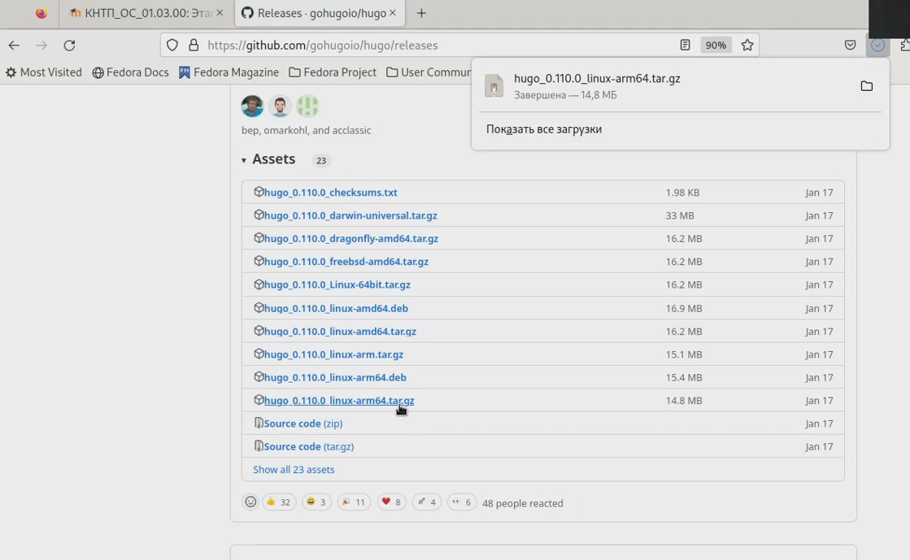{#fig:001 width=70%}

2. Распаковка файла

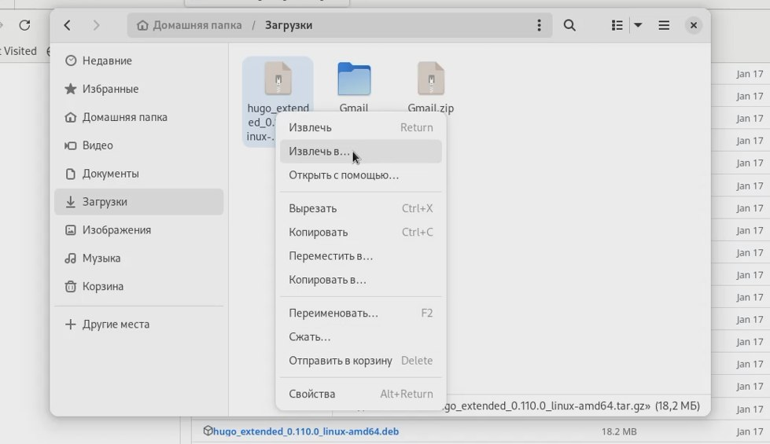{#fig:002 width=70%}

3. Создание необходимого каталога

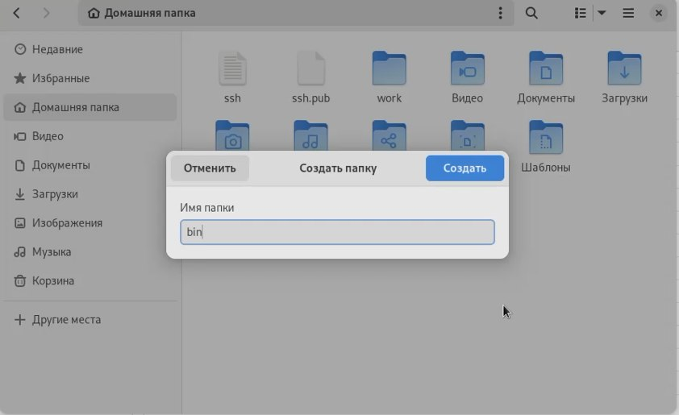{#fig:003 width=70%}

4. Создание репозитория по шаблону индивидуального проекта

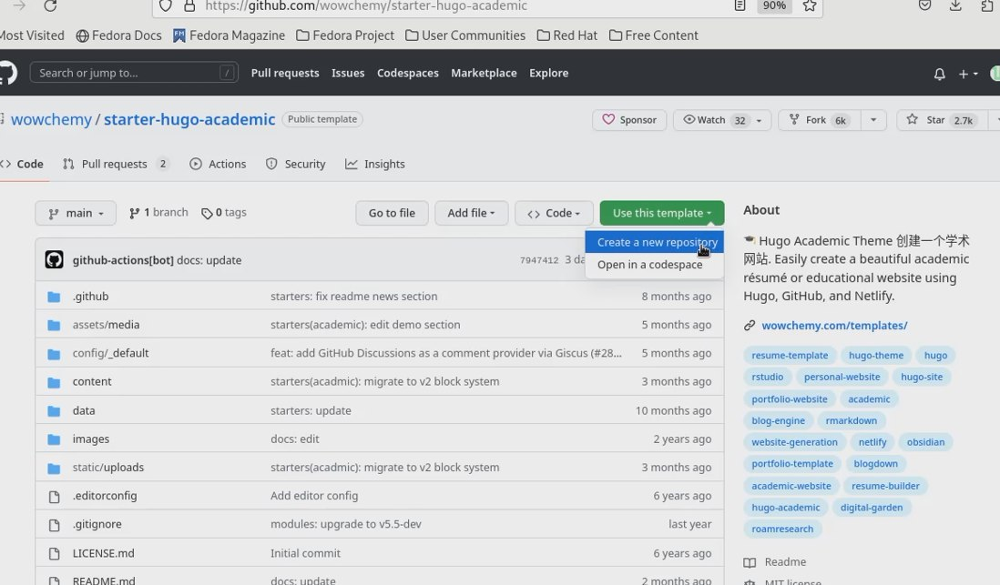{#fig:004 width=70%}

5. Клонирование репозитория

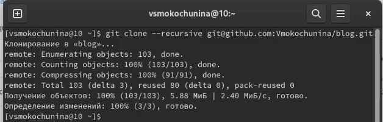{#fig:005 width=70%}

6. Перешли в каталог и проверили,что есть все файлы

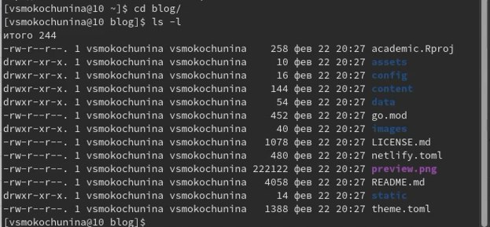{#fig:006 width=70%}

7. Установка hugo

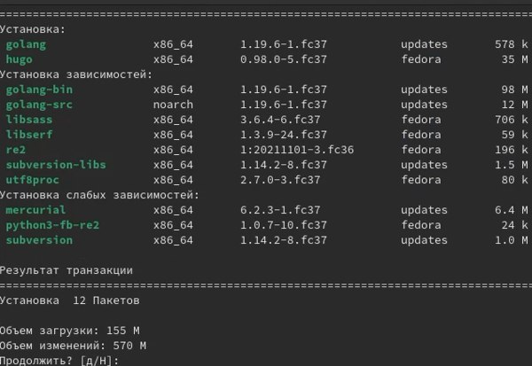{#fig:007 width=70%}

8. Проверка создания файла

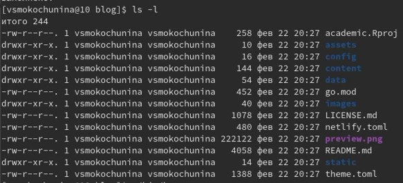{#fig:008 width=70%}

9. Выполнение команды ~/bin/hugo

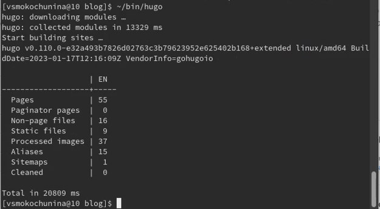{#fig:009 width=70%}

10. Проверка создания файла

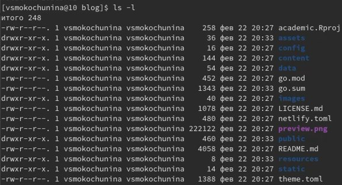{#fig:010 width=70%}

11. Удаление ненужного каталога

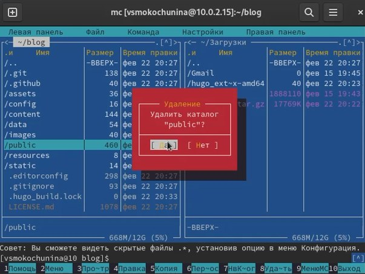{#fig:011 width=70%}

12. Выполнение команды ~/bin/hugo server

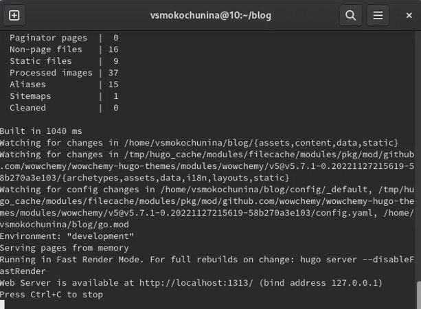{#fig:012 width=70%}

13. Скопировав ссылку из терминала,я ввела ее в браузер и открыла сайт

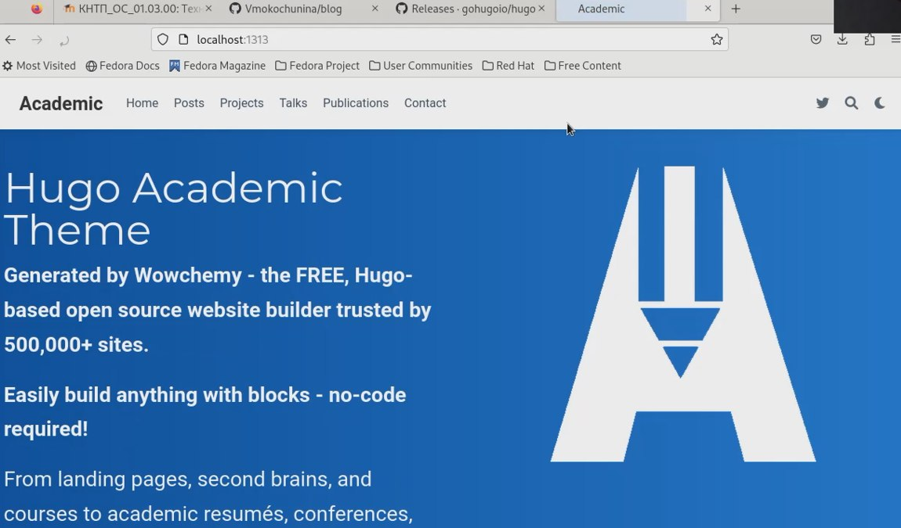{#fig:013 width=70%}

14. Чтобы пропал синий фон,я удалила блок из файла md

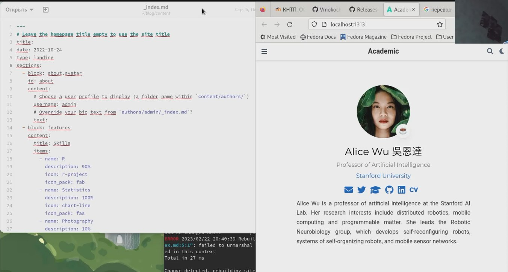{#fig:014 width=70%}

15. Создание репозитория

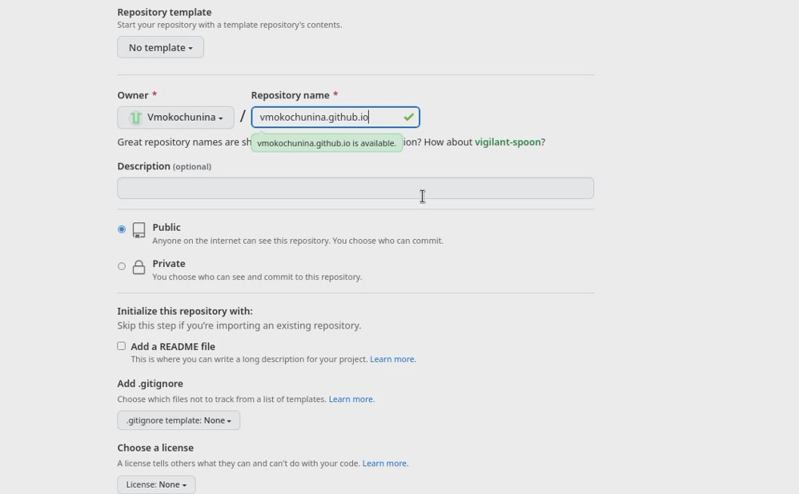{#fig:015 width=70%}

16. Проверка файлов

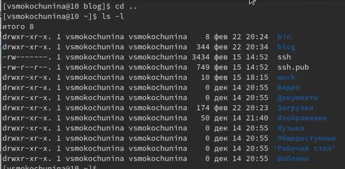{#fig:016 width=70%}

17. Клонирование репозитория

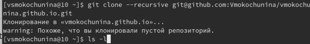{#fig:017 width=70%}

18. Проверили,что репозиторий склонировался

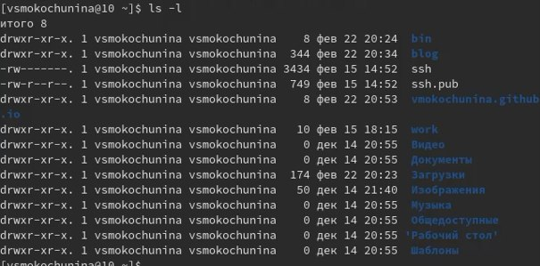{#fig:018 width=70%}

19. Переход в созданную папку и переключение на ветку 

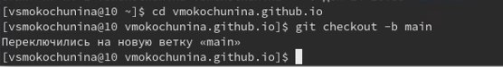{#fig:019 width=70%}

20. Создание файла и его отправка на гитхаб

{#fig:020 width=70%}

21. Видим,что файл перенесся

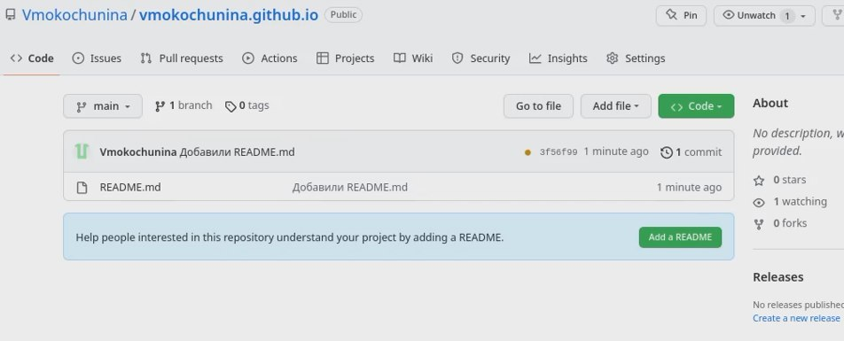{#fig:021 width=70%}

22. Выполнение команды подключения репозитория к папке для эффективной генерации сайта

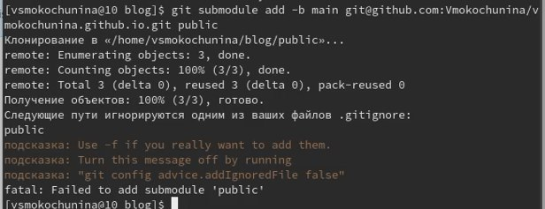{#fig:022 width=70%}

23. Исправляем ошибку игнорирования,комментируем public

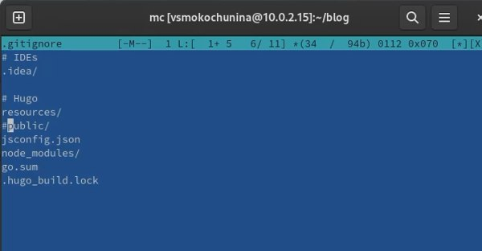{#fig:023 width=70%}

24. Снова выполняю команду подключения репозитория к папке для эффективной генерации сайта

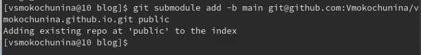{#fig:024 width=70%}

25. Создали файлы в папке

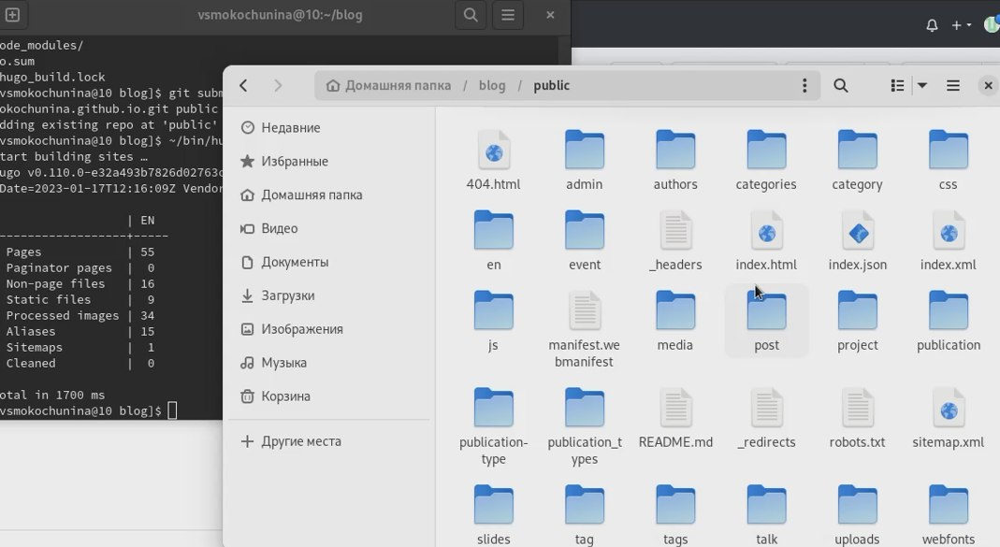{#fig:025 width=70%}

26. Отправление файлов на сервер

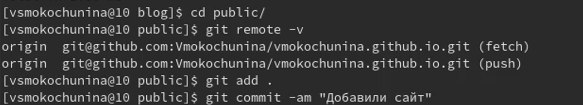{#fig:026 width=70%}

27. Видим,что файлы перенеслись

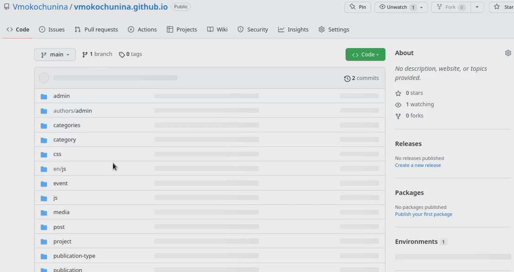{#fig:027 width=70%}

28. Копирую ссылку,чтобы проверить привязку к сайту

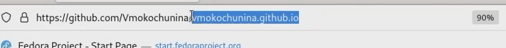{#fig:028 width=70%}

29. Сайт открылся

{#fig:029 width=70%}

# Выводы

Я научилась генерировать сайт,привязывать его к собственному репозиторию

