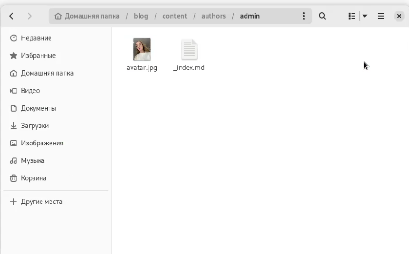
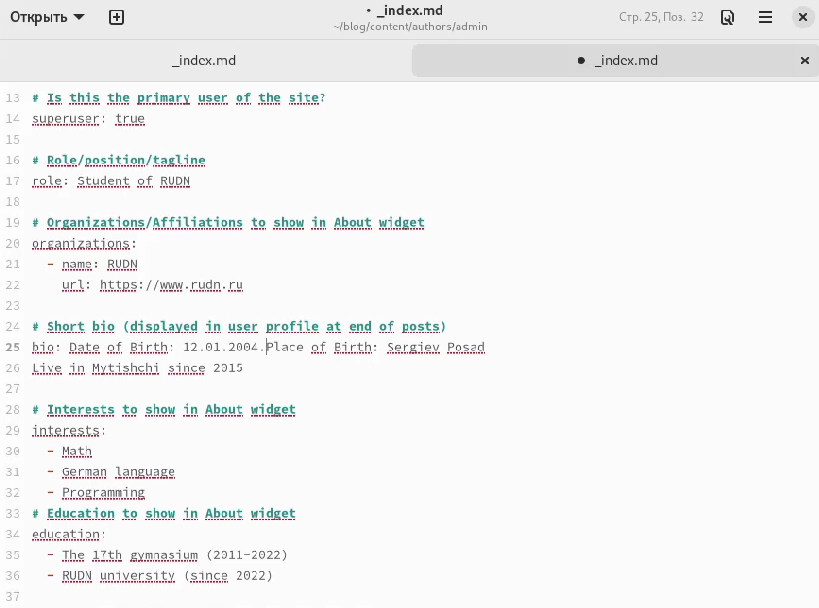
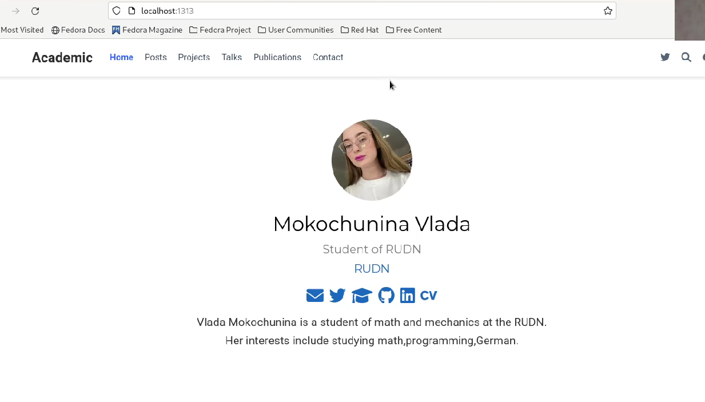
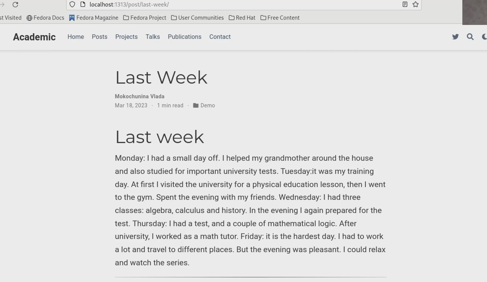
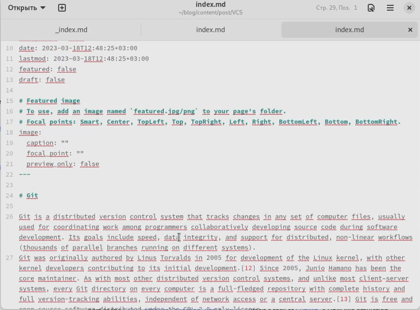
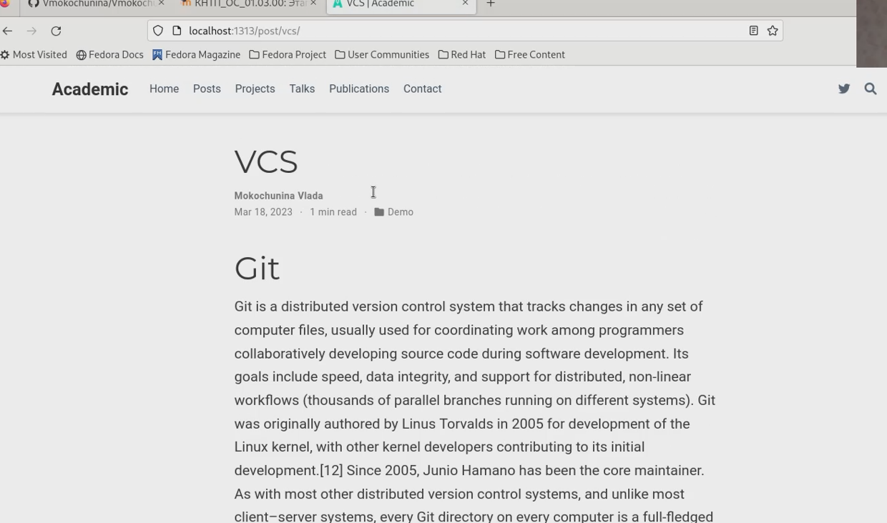

---
## Front matter
lang: ru-RU
title: Отчет по индивидуальному проекту
subtitle: 2 этап
author:
  - Мокочунина Влада Сергеевна
institute:
  - Российский университет дружбы народов, Москва, Россия
date: 18 марта 2023
## i18n babel
babel-lang: russian
babel-otherlangs: english

## Formatting pdf
toc: false
toc-title: Содержание
slide_level: 2
aspectratio: 169
section-titles: true
theme: metropolis
header-includes:
 - \metroset{progressbar=frametitle,sectionpage=progressbar,numbering=fraction}
 - '\makeatletter'
 - '\beamer@ignorenonframefalse'
 - '\makeatother'
---

# Информация

## Докладчик

:::::::::::::: {.columns align=center}
::: {.column width="70%"}

  * Мокочунина Влада Сергеевна
  * Российский университет дружбы народов
  * [vmokochunina@gmail.com](mailto:vmokochunina@gmail.com)
  * <https://github.com/Vmokochunina/study_2022-2023_os-intro.git>

:::
::: {.column width="30%"}
:::
::::::::::::::

# Вводная часть

## Цели и задачи

Загрузить фото,написать информацию о себе (биография,образование,интересы),выложить два поста

# Создание презентации

##   Добавила фотографию для сайта (рис. [-@fig:001]).

{#fig:001 width=70%}

##  Написала информацию о себе ( биография,интересы,образование)

{#fig:002 width=70%}

##  Видим,что все синхронизировалось с сайтом

{#fig:003 width=70%}

##  Написала пост о прошедшей неделе. Вот он уже на сайте

{#fig:004 width=70%}

##  Пишу пост о системе контроля версий

{#fig:005 width=70%}

##  Видим пост на сайте

{#fig:006 width=70%}

# Результаты

Я научилась работать с сайтом: загружать фото,посты,информацию о себе

## Итоговый слайд

Спасибо за внимание!
